---
## Front matter
lang: ru-RU
title: "Введение в Mininet"
subtitle: "Лабораторная работа № 1"
author:
  - Шулуужук А. В.
institute:
  - Российский университет дружбы народов, Москва, Россия
date: 22 март 2025

## i18n babel
babel-lang: russian
babel-otherlangs: english

## Formatting pdf
toc: false
toc-title: Содержание
slide_level: 2
aspectratio: 169
section-titles: true
theme: metropolis
header-includes:
 - \metroset{progressbar=frametitle,sectionpage=progressbar,numbering=fraction}
 - '\makeatletter'
 - '\beamer@ignorenonframefalse'
 - '\makeatother'
---

## Цели и задачи

Основной целью работы является развёртывание в системе виртуализации
(например, в VirtualBox) mininet, знакомство с основными командами для рабо-
ты с Mininet через командную строку и через графический интерфейс.

# Выполнение лабораторной работы

## Выполнение лабораторной работы

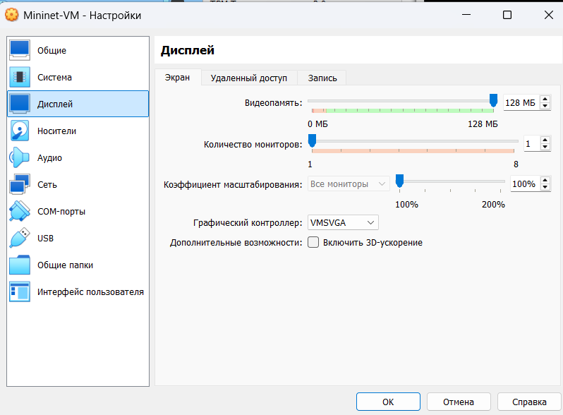{#fig:001 width=60%}

## Выполнение лабораторной работы

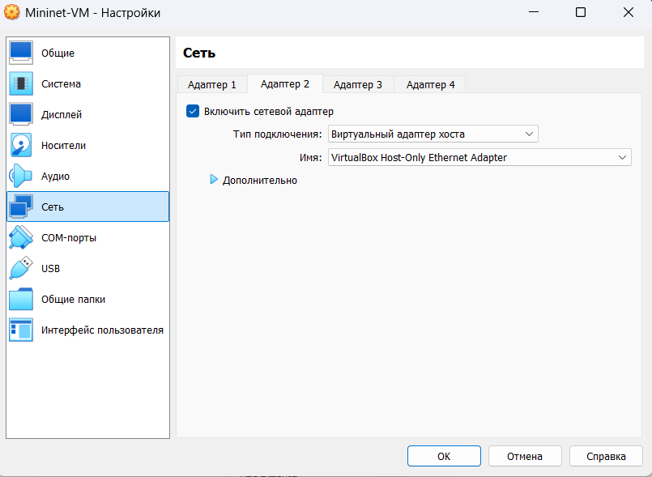{#fig:002 width=60%}

## Выполнение лабораторной работы

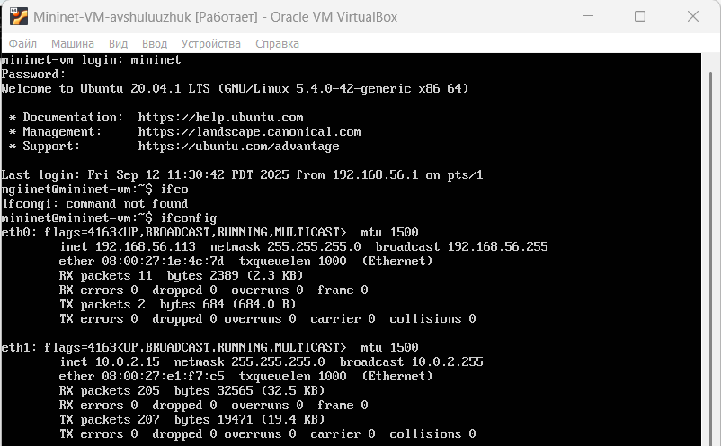{#fig:003 width=70%}

## Выполнение лабораторной работы

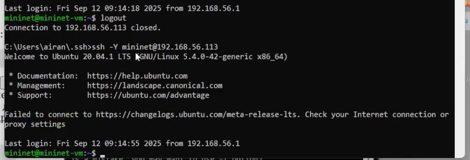{#fig:004 width=70%}

## Настройка доступа к Интернет

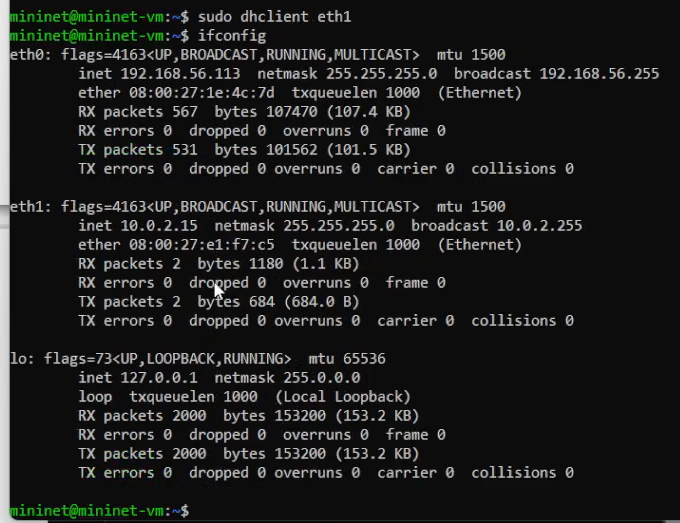{#fig:005 width=50%}

## Настройка доступа к Интернет

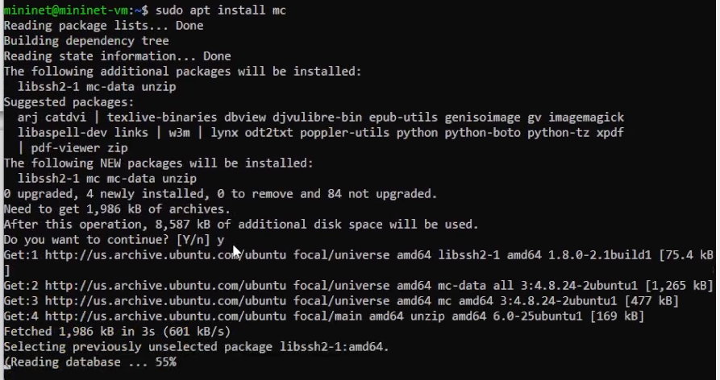{#fig:006 width=70%}

## Настройка доступа к Интернет

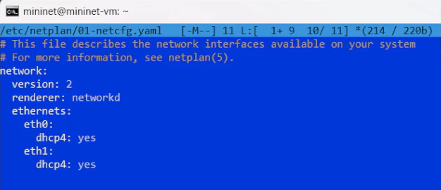{#fig:007 width=70%}

## Обновление версии Mininet

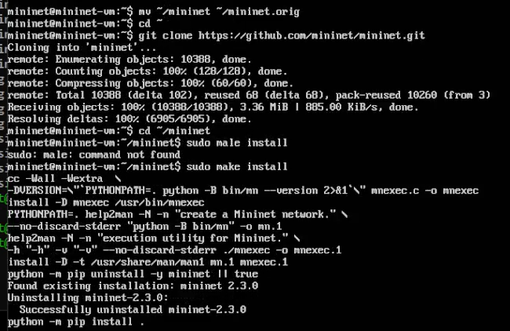{#fig:008 width=70%}

## Обновление версии Mininet

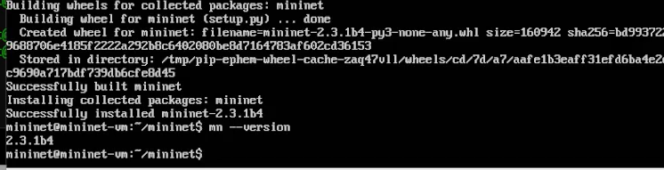{#fig:009 width=70%}

## Настройка параметров XTerm

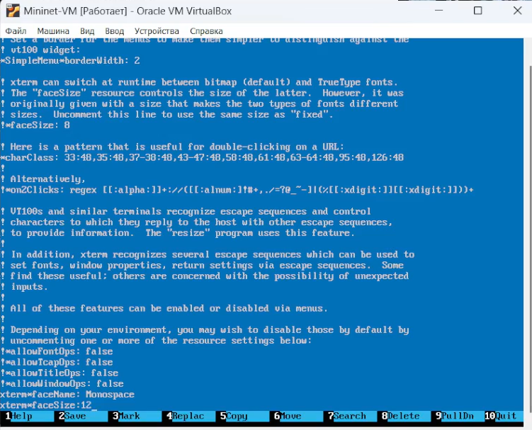{#fig:010 width=60%}

## Настройка соединения X11 для суперпользователя

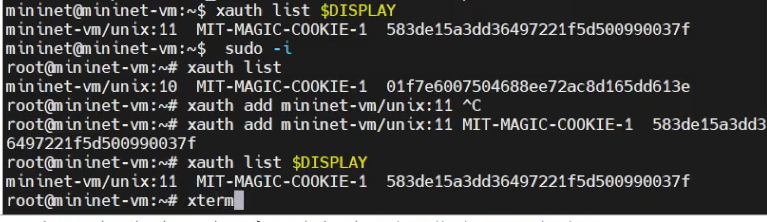{#fig:011 width=70%}

## Работа с Mininet из-под Windows

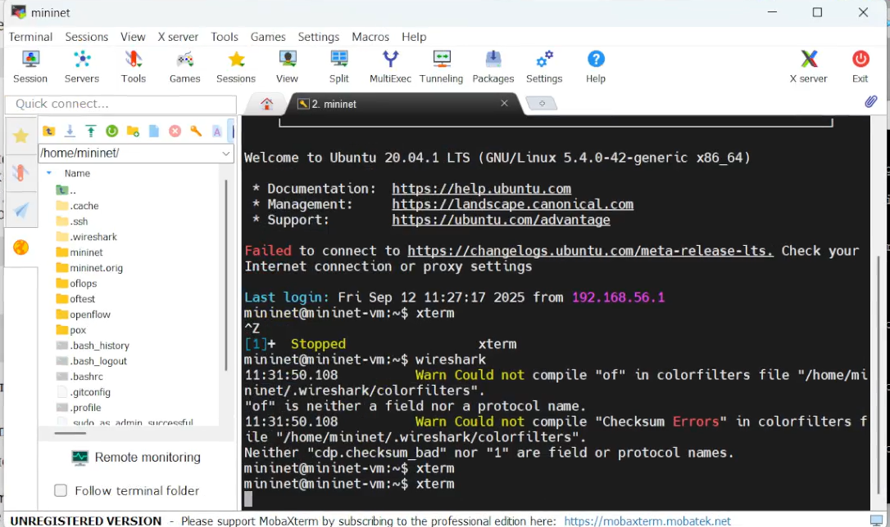{#fig:012 width=70%}

## Основы работы в Mininet

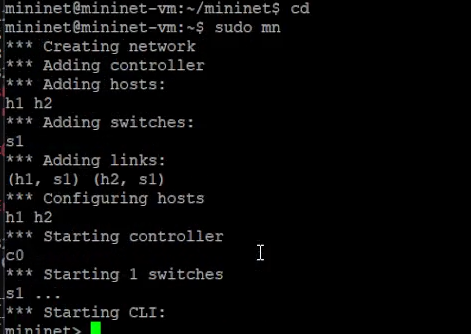{#fig:013 width=70%}

## Основы работы в Mininet

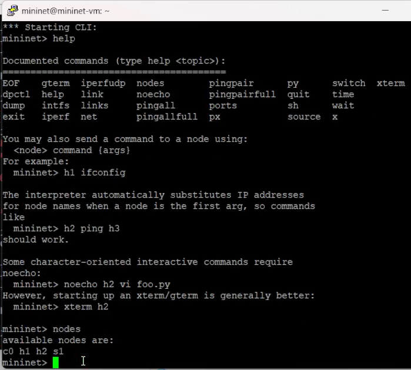{#fig:014 width=50%}

## Основы работы в Mininet

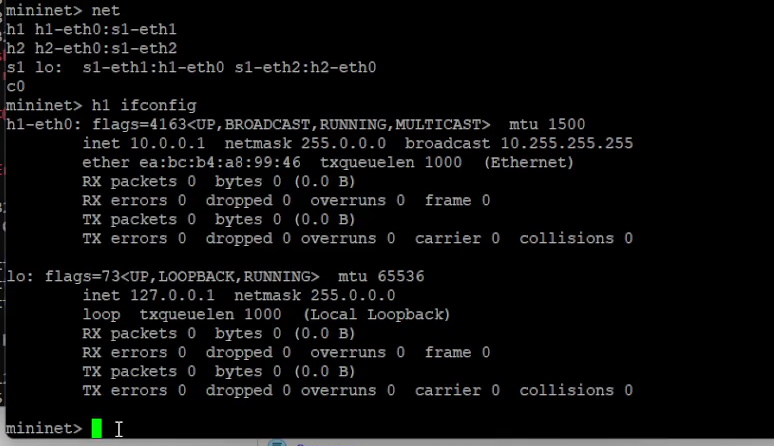{#fig:015 width=70%}

## Основы работы в Mininet

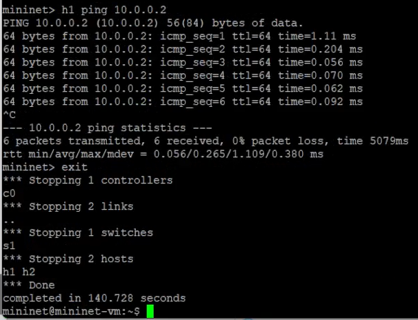{#fig:016 width=60%}

## Построение и эмуляция сети в Mininet с использованием графического интерфейса

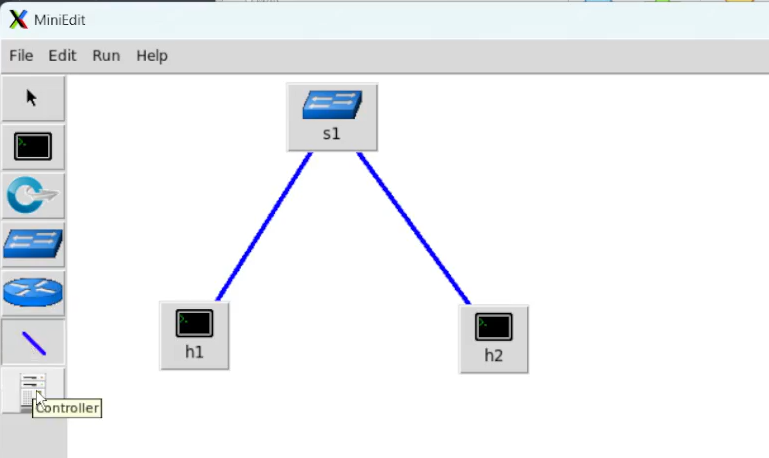{#fig:017 width=70%}

## Построение и эмуляция сети в Mininet с использованием графического интерфейса

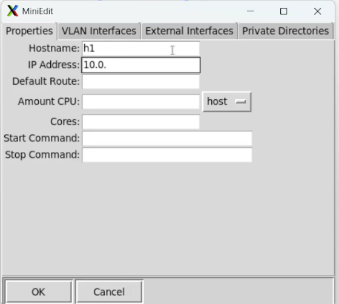{#fig:018 width=50%}

## Построение и эмуляция сети в Mininet с использованием графического интерфейса

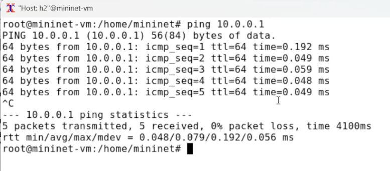{#fig:019 width=70%}

## Построение и эмуляция сети в Mininet с использованием графического интерфейса

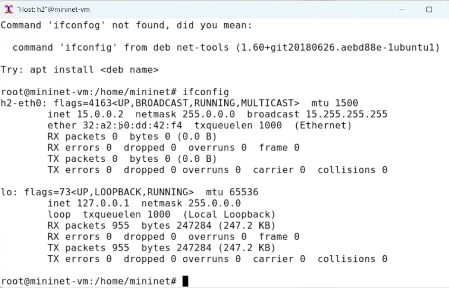{#fig:020 width=70%}

## Построение и эмуляция сети в Mininet с использованием графического интерфейса

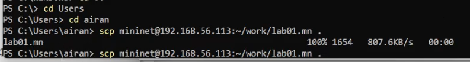{#fig:021 width=70%}

# Выводы

В результате выполнения лабораторной работы было проведено развёртывание в системе виртуализации mininet, знакомство с основными командами для работы с Mininet через командную строку и через графический интерфейс.
