---
## Front matter
title: "Введение в Mininet"
subtitle: "Лабораторная работа № 1"
author: "Шулуужук Айраана НПИбд-02-22"

## Generic otions
lang: ru-RU
toc-title: "Содержание"

## Bibliography
bibliography: bib/cite.bib
csl: pandoc/csl/gost-r-7-0-5-2008-numeric.csl

## Pdf output format
toc: true # Table of contents
toc-depth: 2
lof: true # List of figures
lot: true # List of tables
fontsize: 12pt
linestretch: 1.5
papersize: a4
documentclass: scrreprt
## I18n polyglossia
polyglossia-lang:
  name: russian
  options:
	- spelling=modern
	- babelshorthands=true
polyglossia-otherlangs:
  name: english
## I18n babel
babel-lang: russian
babel-otherlangs: english
## Fonts
mainfont: IBM Plex Serif
romanfont: IBM Plex Serif
sansfont: IBM Plex Sans
monofont: IBM Plex Mono
mathfont: STIX Two Math
mainfontoptions: Ligatures=Common,Ligatures=TeX,Scale=0.94
romanfontoptions: Ligatures=Common,Ligatures=TeX,Scale=0.94
sansfontoptions: Ligatures=Common,Ligatures=TeX,Scale=MatchLowercase,Scale=0.94
monofontoptions: Scale=MatchLowercase,Scale=0.94,FakeStretch=0.9
mathfontoptions:
## Biblatex
biblatex: true
biblio-style: "gost-numeric"
biblatexoptions:
  - parentracker=true
  - backend=biber
  - hyperref=auto
  - language=auto
  - autolang=other*
  - citestyle=gost-numeric
## Pandoc-crossref LaTeX customization
figureTitle: "Рис."
tableTitle: "Таблица"
listingTitle: "Листинг"
lofTitle: "Список иллюстраций"
lotTitle: "Список таблиц"
lolTitle: "Листинги"
## Misc options
indent: true
header-includes:
  - \usepackage{indentfirst}
  - \usepackage{float} # keep figures where there are in the text
  - \floatplacement{figure}{H} # keep figures where there are in the text
---

# Цель работы

Основной целью работы является развёртывание в системе виртуализации
(например, в VirtualBox) mininet, знакомство с основными командами для рабо-
ты с Mininet через командную строку и через графический интерфейс.

# Выполнение лабораторной работы

## Подключение к виртуальной машине

Запустим систему виртуализации и импортируем файл .ovf. Перейдем в настройки системы виртуализации и уточним параметры настройки виртуальной машины. Перейдите к опции «Система». Следуя рекомендациям, внесем исправления (рис. [-@fig:001]) 

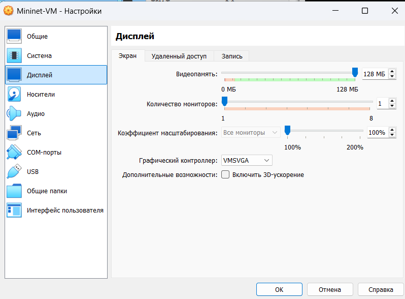{#fig:001 width=70%}

В настройках сети первый адаптер должен иметь подключение типа
NAT. Для второго адаптера укажем тип подключения host-only network adapter
(виртуальный адаптер хоста), который в дальнейшем мы будете использо-
вать для входа в образ виртуальной машины  (рис. [-@fig:002])

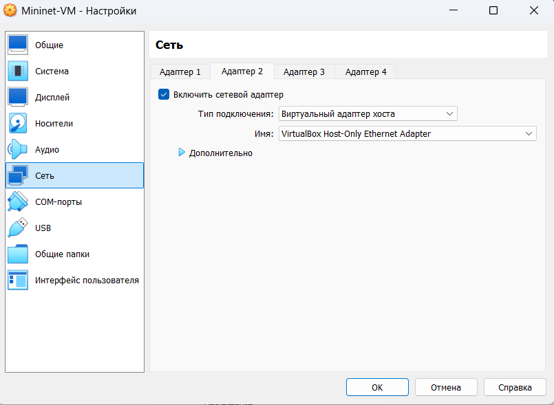{#fig:002 width=70%}

Запустим виртуальную машину с Mininet (рис. [-@fig:003])

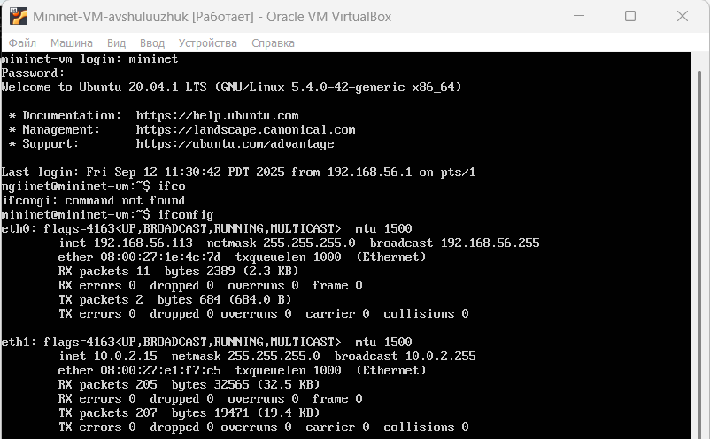{#fig:003 width=70%}

Подключимся к виртуальной машине (из терминала хостовой машины) по ssh ключу. Подсоединение происходит успешно и без ввода пароля (рис. [-@fig:004])

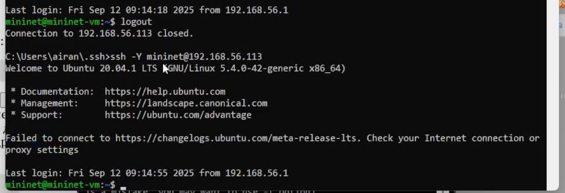{#fig:004 width=70%}

## Настройка доступа к Интернет

После подключения к виртуальной машине mininet посмотрим IP-адреса машины. Для доступа к сети Интернет должен быть активен адрес NAT: 10.0.0.x. Если активен только внутренний адрес машины вида 192.168.x.y, то акти-
вируем второй интерфейс (рис. [-@fig:005])

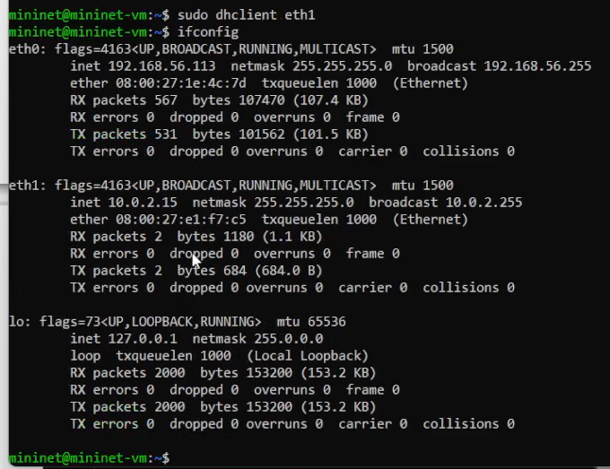{#fig:005 width=70%}

Для удобства дальнейшей работы установим mс (рис. [-@fig:006])

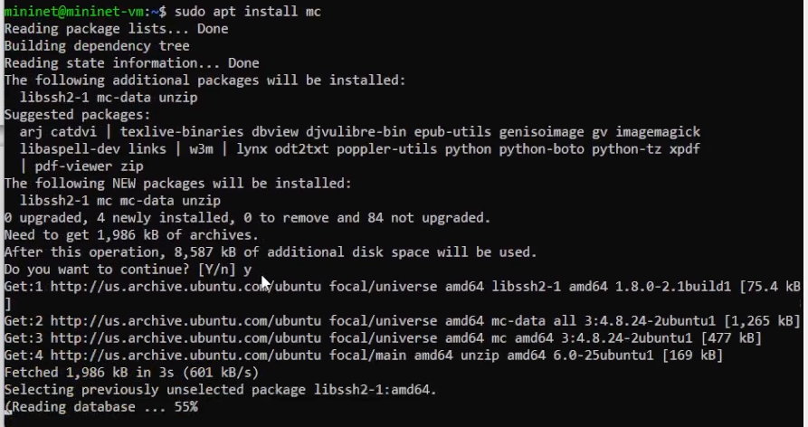{#fig:006 width=70%}

Добавим для mininet указание на использование двух адаптеров при запуске. Для этого требуется перейти
в режим суперпользователя и внести изменения в файл /etc/netplan/01-netcfg.yaml виртуальной машины mininet: (рис. [-@fig:007])

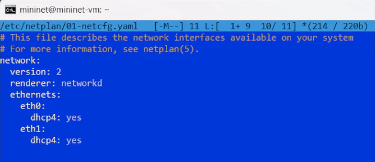{#fig:007 width=70%}

## Обновление версии Mininet

В виртуальной машине mininet переименуем предыдущую установку Mininet. Скачаем новую версию Mininet и обновим исполняемые файлы (рис. [-@fig:008]).

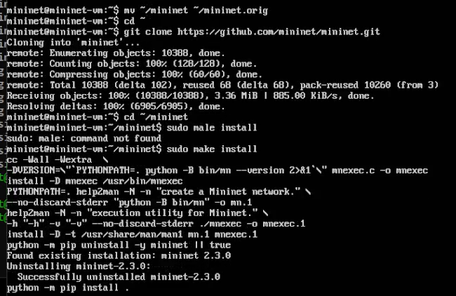{#fig:008 width=70%}

Проверим номер установленной версии (рис. [-@fig:009]).

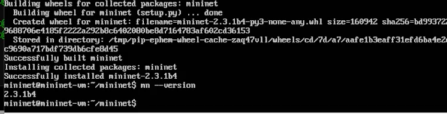{#fig:009 width=70%}

## Настройка параметров XTerm

По умолчанию XTerm использует растровые шрифты малого кегля. Для увеличения размера шрифта и применения векторных шрифтов вместо растровых необходимо внести изменения в файл /etc/X11/app-defaults/XTerm. Здесь выбран системный моноширинный шрифт, кегль шрифта — 12 пунктов (рис. [-@fig:010]).

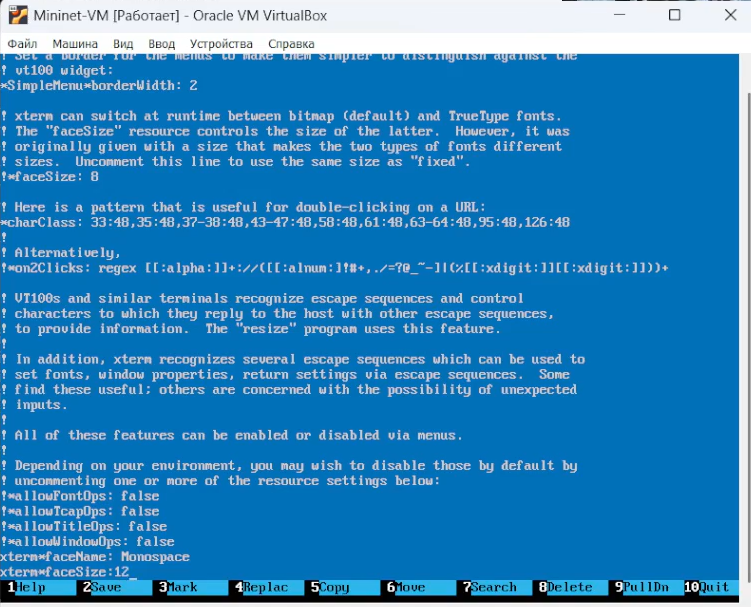{#fig:010 width=70%}

## Настройка соединения X11 для суперпользователя

Скопируем значение куки (MIT magic cookie)1 пользователя mininet в файл для пользователя root. После выполнения этих действий графические приложения должны запускаться под пользователем mininet (рис. [-@fig:011])

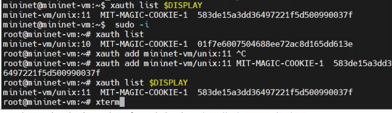{#fig:011 width=70%}

## Работа с Mininet из-под Windows

Для работы с графическими приложениями я использовала Xserver: MobaXterm (рис. [-@fig:012])

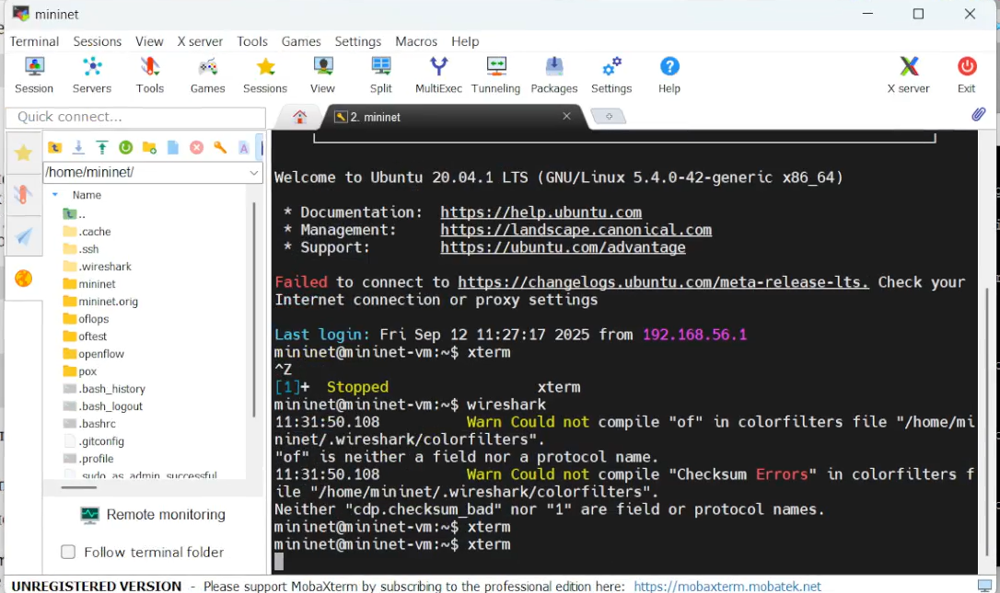{#fig:012 width=70%}

## Основы работы в Mininet

Вызов Mininet с использованием топологии по умолчанию. Для запуска минимальной топологии введем в командной строке  (рис. [-@fig:013])

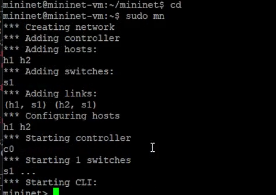{#fig:013 width=70%}

Для отображения списка команд интерфейса командной строки Mininet и примеров их использования введем команду в интерфейсе командной строки Mininet: help. Для отображения доступных узлов введите: nodes. Вывод этой команды показывает, что есть два хоста (хост h1 и хост h2) и коммутатор (s1) (рис. [-@fig:014]) (рис. [-@fig:015])

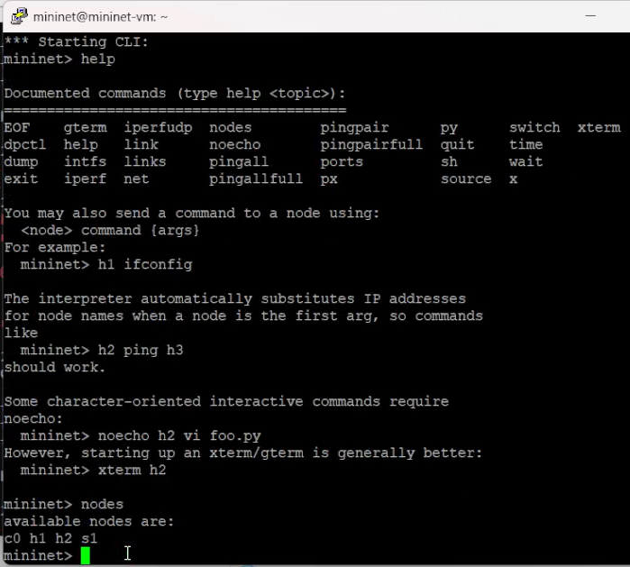{#fig:014 width=70%}

Просмотрим доступные линки net. Вывод этой команды показывает:
– Хост h1 подключён через свой сетевой интерфейс h1-eth0 к коммутато-
ру на интерфейсе s1-eth1.
– Хост h2 подключён через свой сетевой интерфейс h2-eth0 к коммутато-
ру на интерфейсе s1-eth2.
– Коммутатор s1:
– имеет петлевой интерфейс lo.
– подключается к h1-eth0 через интерфейс s1-eth1.
– подключается к h2-eth0 через интерфейс s1-eth2.
– Mininet позволяет выполнять команды на конкретном устройстве. Чтобы
выполнить команду для определенного узла, необходимо сначала указать
устройство, а затем команду, например: h1 ifconfig

Эта запись выполняет команду ifconfig на хосте h1 и показывает ин-
терфейсы хоста h1 — хост h1 имеет интерфейс h1-eth0, настроенный
с IP-адресом 10.0.0.1, и другой интерфейс lo, настроенный с IP-адресом
127.0.0.1. (рис. [-@fig:015])

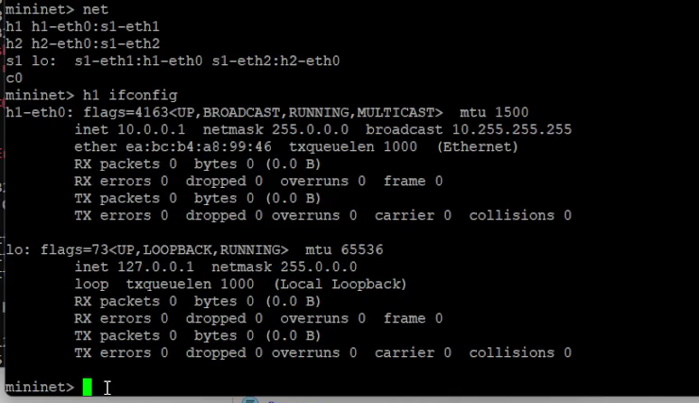{#fig:015 width=70%}

Чтобы проверить связь между ними, вы можете
использовать команду ping. Команда ping работает, отправляя сообщения
эхо-запроса протокола управляющих сообщений Интернета (ICMP) на уда-
лённый компьютер и ожидая ответа. (рис. [-@fig:016])

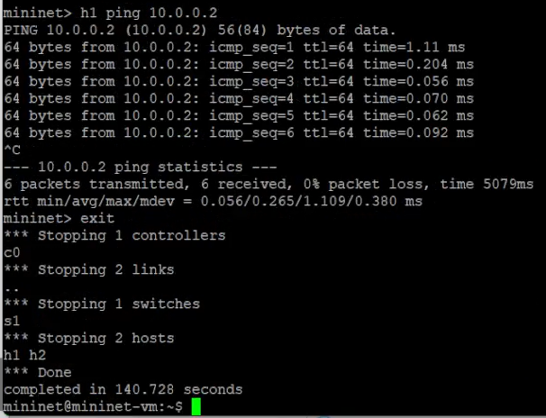{#fig:016 width=70%}

## Построение и эмуляция сети в Mininet с использованием графического интерфейса

В терминале виртуальной машины mininet запустим MiniEdit. Добавим два хоста и один коммутатор, соедините хосты с коммутатором (рис. [-@fig:017])

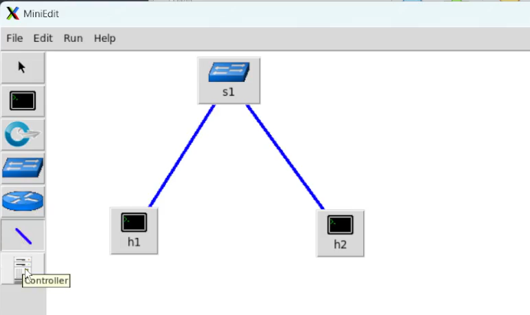{#fig:017 width=70%}

Настроем IP-адреса на хостах h1 и h2. Для этого удерживая правую кнопку
мыши на устройстве выберите свойства. Для хоста h1 укажем IP-адрес
10.0.0.1/8, а для хоста h2 — 10.0.0.2/8 (рис. [-@fig:018])

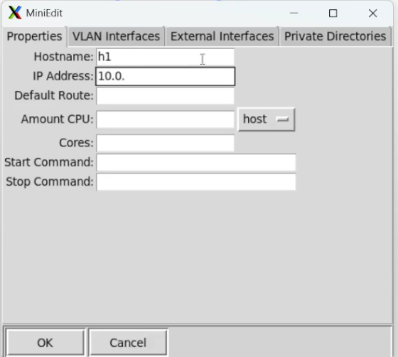{#fig:018 width=70%}

Проверка связности. Пропингуем хосты h1 и h2 (рис. [-@fig:019])

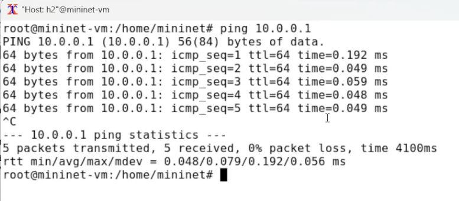{#fig:019 width=70%}

Автоматическое назначение IP-адресов. Ранее IP-адреса узлам h1 и h2 были назначены вручную. В качестве аль-
тернативы можно полагаться на Mininet для автоматического назначения IP-адресов. По умолчанию в поле базовые значе-
ния IP-адресов (IP Base) установлено 10.0.0.0/8. Изменим это значение на 15.0.0.0/8 (рис. [-@fig:020])

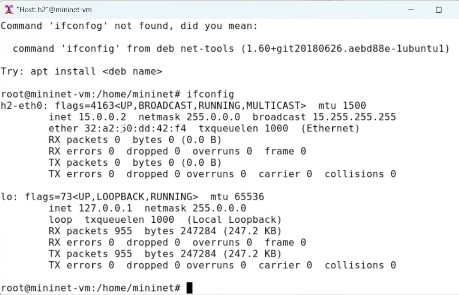{#fig:020 width=70%}

Сохранение и загрузка топологии Mininet. В домашнем каталоге виртуальной машины mininet создадим каталог для
работы с проектами mininet. Укажем имя для топологии и сохраним на своём компьютере. После сохранения проекта поменяем права доступа к файлам в каталоге проекта (рис. [-@fig:021])

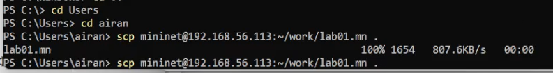{#fig:021 width=70%}

# Выводы

В результате выполнения лабораторной работы было проведено развёртывание в системе виртуализации mininet, знакомство с основными командами для работы с Mininet через командную строку и через графический интерфейс.
