---
## Front matter
lang: ru-RU
title: "Измерение
и тестирование пропускной способности сети.
Интерактивный эксперимент"
subtitle: "Лабораторная работа № 2"
author:
  - Шулуужук А. В.
institute:
  - Российский университет дружбы народов, Москва, Россия
date: 22 март 2025

## i18n babel
babel-lang: russian
babel-otherlangs: english

## Formatting pdf
toc: false
toc-title: Содержание
slide_level: 2
aspectratio: 169
section-titles: true
theme: metropolis
header-includes:
 - \metroset{progressbar=frametitle,sectionpage=progressbar,numbering=fraction}
 - '\makeatletter'
 - '\beamer@ignorenonframefalse'
 - '\makeatother'
---

## Цели и задачи

Основной целью работы является знакомство с инструментом для измерения
пропускной способности сети в режиме реального времени — iPerf3, а также
получение навыков проведения интерактивного эксперимента по измерению
пропускной способности моделируемой сети в среде Mininet.

# Выполнение лабораторной работы

## Установка необходимого программного обеспечения

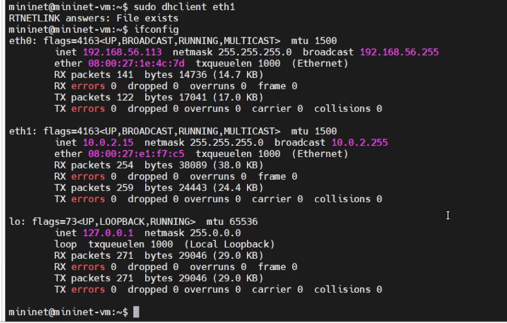{#fig:001 width=70%}

## Установка необходимого программного обеспечения

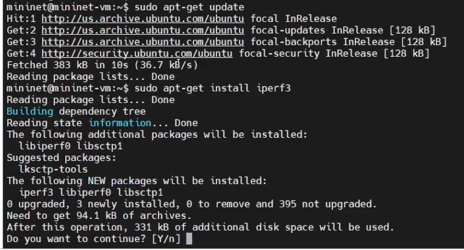{#fig:002 width=70%}

## Установка необходимого программного обеспечения

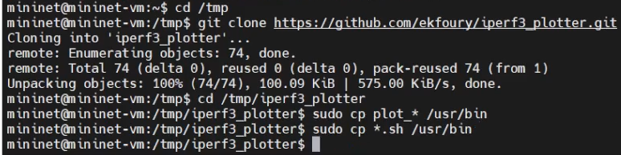{#fig:003 width=70%}

## Интерактивные эксперименты

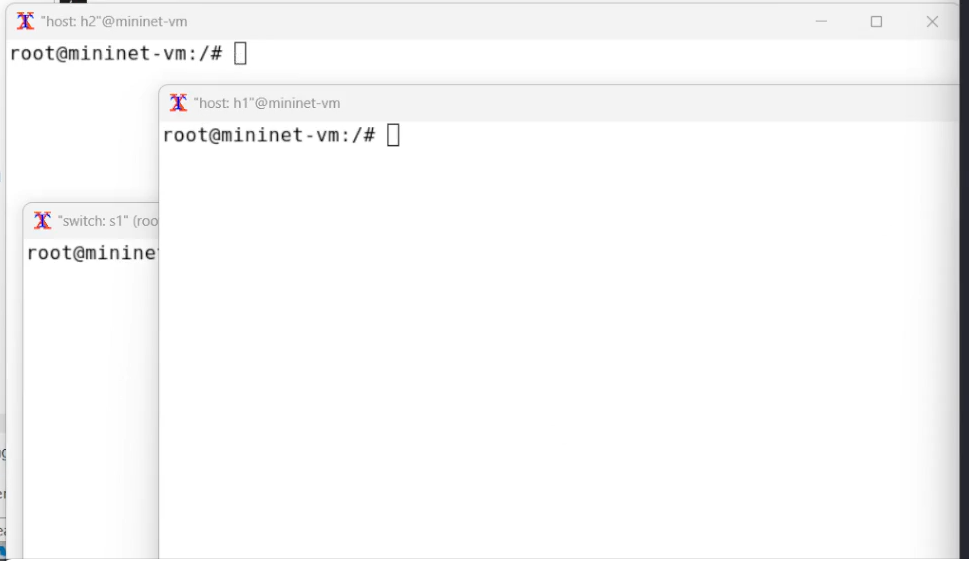{#fig:004 width=70%}

## Интерактивные эксперименты

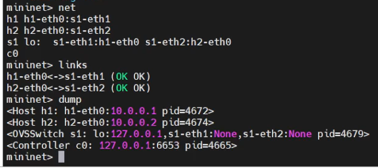{#fig:005 width=70%}

## Интерактивные эксперименты

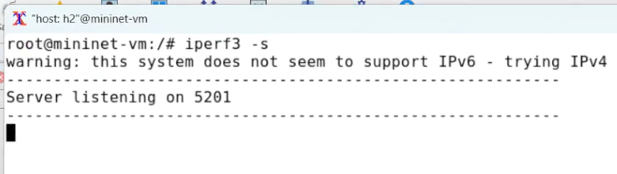{#fig:006 width=70%}

## Интерактивные эксперименты

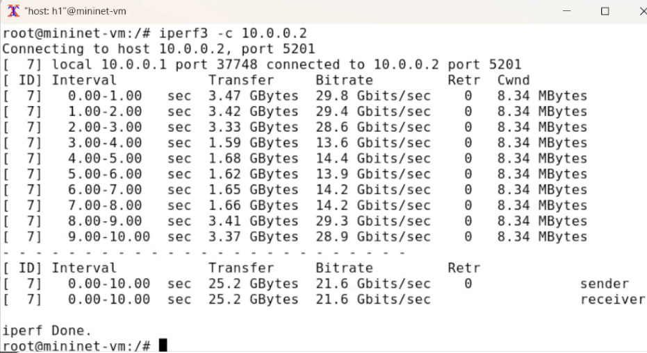{#fig:007 width=70%}

## Интерактивные эксперименты

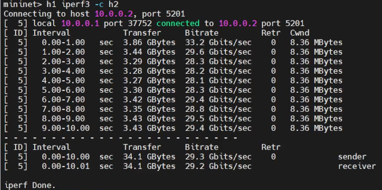{#fig:008 width=70%}

## Интерактивные эксперименты

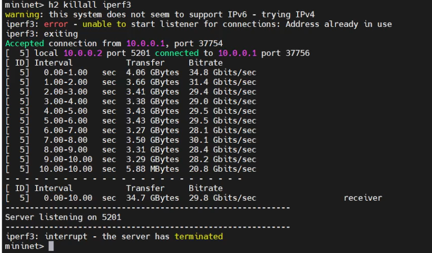{#fig:009 width=70%}

## Интерактивные эксперименты

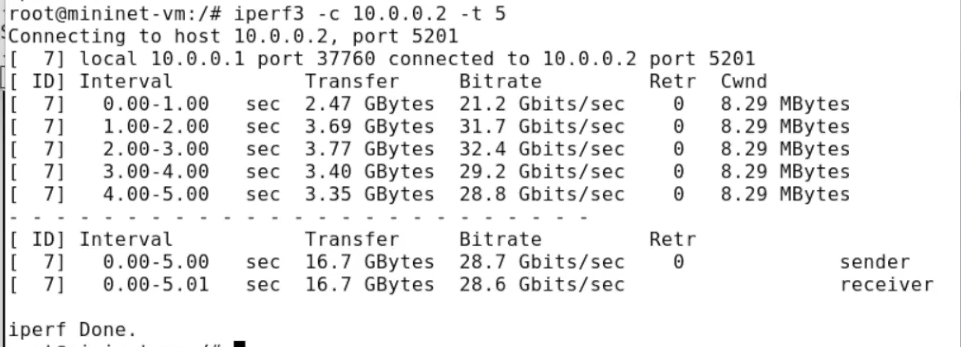{#fig:010 width=70%}

## Интерактивные эксперименты

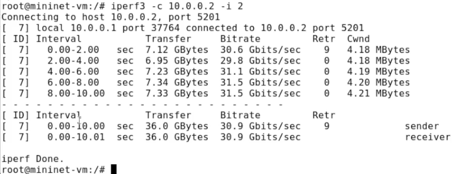{#fig:011 width=70%}

## Интерактивные эксперименты

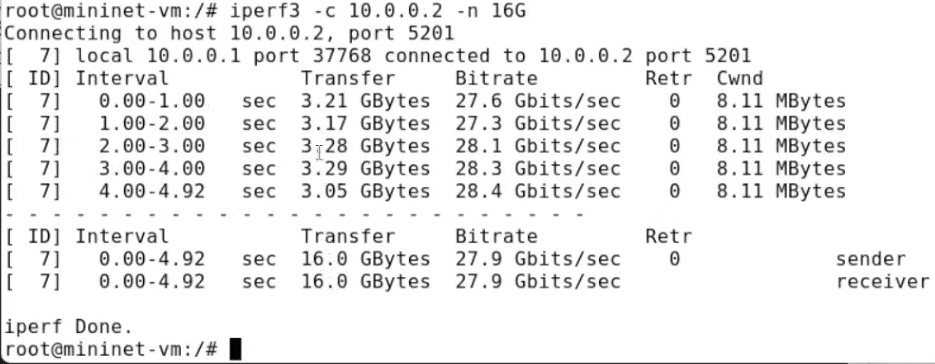{#fig:012 width=70%}

## Интерактивные эксперименты

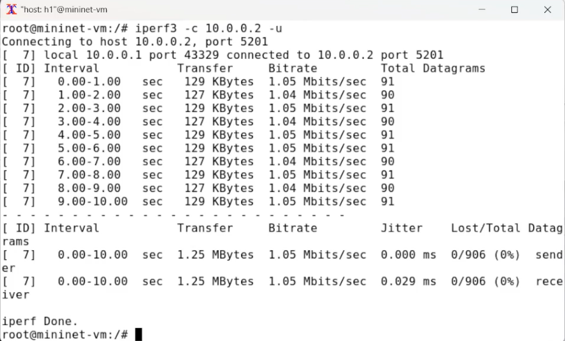{#fig:013 width=70%}

## Интерактивные эксперименты

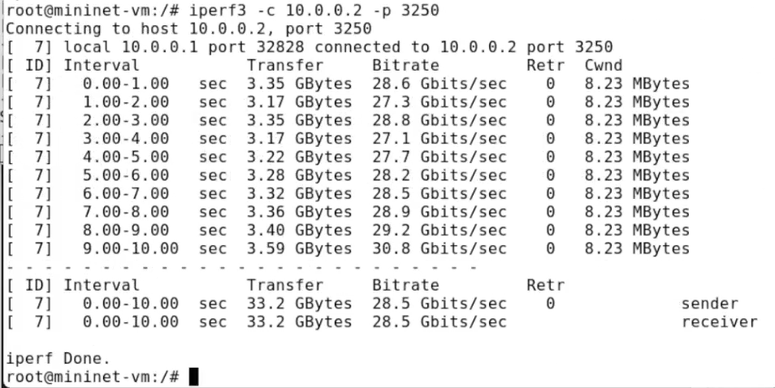{#fig:014 width=70%}

## Интерактивные эксперименты

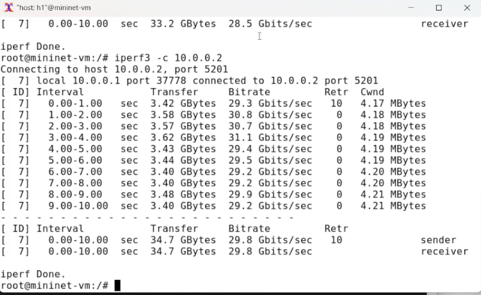{#fig:015 width=70%}

## Интерактивные эксперименты

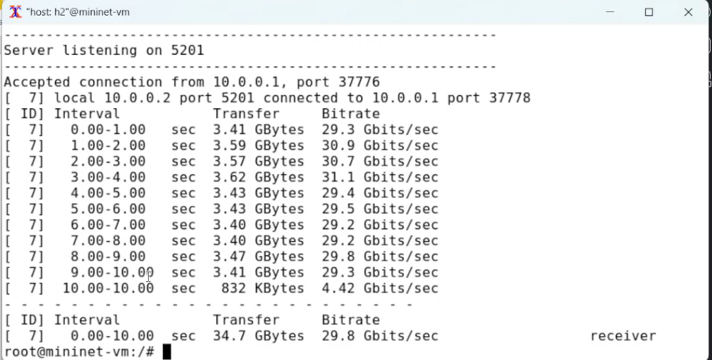{#fig:016 width=70%}

## Интерактивные эксперименты

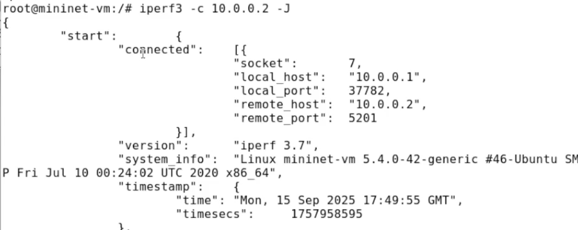{#fig:017 width=70%}

## Интерактивные эксперименты

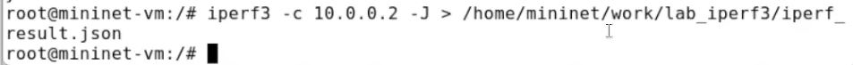{#fig:018 width=70%}

## Интерактивные эксперименты

{#fig:019 width=70%}

## Интерактивные эксперименты

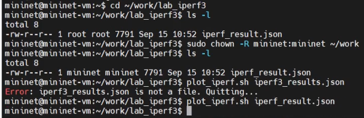{#fig:020 width=70%}

## Интерактивные эксперименты

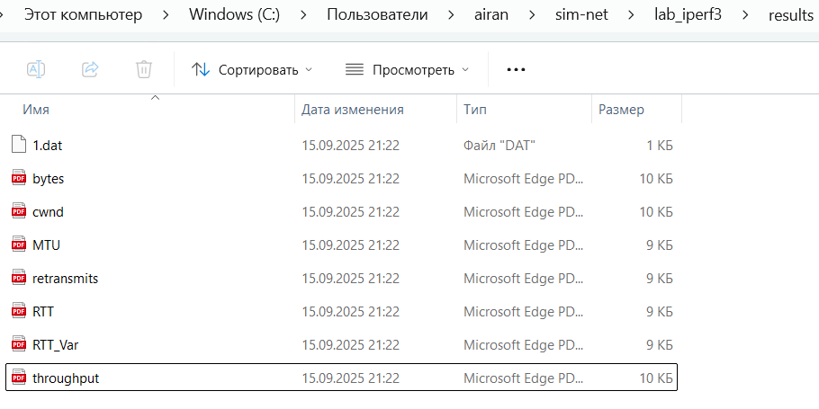{#fig:029 width=70%}

# Выводы

В результате выполнения лабораторной работы было проведено знакомство с инструментом для измерения
пропускной способности сети в режиме реального времени — iPerf3, а также
получение навыков проведения интерактивного эксперимента по измерению
пропускной способности моделируемой сети в среде Mininet

