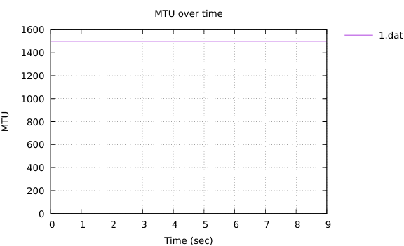

---
## Front matter
title: "Измерение
и тестирование пропускной способности сети.
Интерактивный эксперимент"
subtitle: "Лабораторная работа № 2"
author: "Шулуужук Айраана НПИбд-02-22"

## Generic otions
lang: ru-RU
toc-title: "Содержание"

## Bibliography
bibliography: bib/cite.bib
csl: pandoc/csl/gost-r-7-0-5-2008-numeric.csl

## Pdf output format
toc: true # Table of contents
toc-depth: 2
lof: true # List of figures
lot: true # List of tables
fontsize: 12pt
linestretch: 1.5
papersize: a4
documentclass: scrreprt
## I18n polyglossia
polyglossia-lang:
  name: russian
  options:
	- spelling=modern
	- babelshorthands=true
polyglossia-otherlangs:
  name: english
## I18n babel
babel-lang: russian
babel-otherlangs: english
## Fonts
mainfont: IBM Plex Serif
romanfont: IBM Plex Serif
sansfont: IBM Plex Sans
monofont: IBM Plex Mono
mathfont: STIX Two Math
mainfontoptions: Ligatures=Common,Ligatures=TeX,Scale=0.94
romanfontoptions: Ligatures=Common,Ligatures=TeX,Scale=0.94
sansfontoptions: Ligatures=Common,Ligatures=TeX,Scale=MatchLowercase,Scale=0.94
monofontoptions: Scale=MatchLowercase,Scale=0.94,FakeStretch=0.9
mathfontoptions:
## Biblatex
biblatex: true
biblio-style: "gost-numeric"
biblatexoptions:
  - parentracker=true
  - backend=biber
  - hyperref=auto
  - language=auto
  - autolang=other*
  - citestyle=gost-numeric
## Pandoc-crossref LaTeX customization
figureTitle: "Рис."
tableTitle: "Таблица"
listingTitle: "Листинг"
lofTitle: "Список иллюстраций"
lotTitle: "Список таблиц"
lolTitle: "Листинги"
## Misc options
indent: true
header-includes:
  - \usepackage{indentfirst}
  - \usepackage{float} # keep figures where there are in the text
  - \floatplacement{figure}{H} # keep figures where there are in the text
---

# Цель работы

Основной целью работы является знакомство с инструментом для измерения
пропускной способности сети в режиме реального времени — iPerf3, а также
получение навыков проведения интерактивного эксперимента по измерению
пропускной способности моделируемой сети в среде Mininet.

# Выполнение лабораторной работы

## Установка необходимого программного обеспечения

Для доступа к сети Интернет должен быть активен адрес NAT: 10.0.0.x (рис. [-@fig:001]) 

{#fig:001 width=70%}

Обновим репозиторий программного обеспечения на виртуальной машине и установим iperf3 (рис. [-@fig:002])

{#fig:002 width=70%}

Развернем iperf3_plotter. Для этого перейдем во временный каталог, скачаем репозиторий и установим его (рис. [-@fig:003])

{#fig:003 width=70%}

## Интерактивные эксперименты

Зададим простейшую топологию, состоящую из двух хостов и коммутатора с назначенной по умолчанию mininet сетью 10.0.0.0/8 (рис. [-@fig:004])

{#fig:004 width=70%}

В терминале виртуальной машины посмотрим параметры запущенной в интерактивном режиме топологии (рис. [-@fig:005])

{#fig:005 width=70%}

Проведем простейший интерактивный эксперимент по измерению пропускной способности с помощью iPerf3. В терминале h2 запустим сервер iPerf3. После запуска этой команды хост h2 перейдёт в состояние прослушивания
5201-го порта в ожидании входящих подключений (рис. [-@fig:006])

{#fig:006 width=70%}

В терминале хоста h1 запустите клиент iPerf3. Здесь параметр -c указывает, что хост h1 настроен как клиент, а параметр 10.0.0.2 является IP-адресом сервера iPerf3 (рис. [-@fig:007])

{#fig:007 width=70%}

Проведем аналогичный эксперимент в интерфейсе mininet. Запустим сервер iPerf3 на хосте h2 и запустим клиент iPerf3 на хосте h1(рис. [-@fig:008]).

{#fig:008 width=70%}

Остановим серверный процесс (рис. [-@fig:009]).

{#fig:009 width=70%}

Для указания iPerf3 периода времени для передачи можно использовать ключ -t (или --time) — время в секундах для передачи (по умолчанию 10 секунд). Запустим сервер и запустим клиента с указанием параметра -t 5, теперь общее время передачи 5 секунд (рис. [-@fig:010]).

{#fig:010 width=70%}

Настроем клиент iPerf3 для выполнения теста пропускной способности с 2-секундным интервалом времени отсчёта как на клиенте, так и на сервере. Используем опцию -i для установки интервала между отсчётами, измеряемого в секундах (рис. [-@fig:011])

{#fig:011 width=70%}

Зададим на клиенте iPerf3 отправку определённого объёма данных. Используем опцию -n для установки количества байт для передачи. При задании количества данных для передачи клиент iPerf3 будет продолжать отправлять пакеты до тех пор, пока не будет отправлен весь объем данных, указанный пользователем (рис. [-@fig:012])

{#fig:012 width=70%}

Изменим в тесте измерения пропускной способности iPerf3 протокол передачи данных с TCP (установлен по умолчанию) на UDP. iPerf3 автоматически определяет протокол транспортного уровня на стороне сервера. Для изменения протокола используем опцию -u на стороне клиента iPerf3. Запустим клиент, задав протокол UPD (рис. [-@fig:013])

{#fig:013 width=70%}

В тесте измерения пропускной способности iPerf3 изменим номер порта для отправки/получения пакетов или датаграмм через указанный порт. Используйте для этого опцию -p с указанием порта (рис. [-@fig:014]) (рис. [-@fig:015])

{#fig:014 width=70%}

По умолчанию после запуска сервер iPerf3 постоянно прослушивает входящие соединения. В тесте измерения пропускной способности iPerf3 зададим для сервера параметр обработки данных только от одного клиента с остановкой сервера по завершении теста. Для этого используем опцию -1 на сервере iPerf3 (рис. [-@fig:015]) (рис. [-@fig:016])

{#fig:015 width=70%}

{#fig:016 width=70%}

Экспортируем результаты теста измерения пропускной способности iPerf3 в файл JSON. В виртуальной машине mininet создадим каталог для работы над проектом. В терминале h2 запустим сервер iPerf3. В терминале h1 запустим клиент iPerf3, указав параметр -J для отображения вывода результатов в формате JSON (рис. [-@fig:017])

{#fig:017 width=70%}

Экспортируем вывод результатов теста в файл, перенаправив стандартный вывод в файл (рис. [-@fig:018])

{#fig:018 width=70%}

Просмотрим экспортируемый файл (рис. [-@fig:019])

{#fig:019 width=70%}

В виртуальной машине mininet перейдем в каталог для работы над проектом, проверим и при необходимости скорректируйте права доступа к файлу JSON. Сгенерируем выходные данные для файла JSON iPerf3, выполнив следующую команду (рис. [-@fig:020])

{#fig:020 width=70%}

Просмотр выходных файлов (рис. [-@fig:029])

{#fig:029 width=70%}

{#fig:021 width=70%}
{#fig:022 width=70%}
{#fig:023 width=70%}
{#fig:024 width=70%}
{#fig:025 width=70%}
{#fig:026 width=70%}
{#fig:027 width=70%}
{#fig:028 width=70%}

# Выводы

В результате выполнения лабораторной работы было проведено знакомство с инструментом для измерения
пропускной способности сети в режиме реального времени — iPerf3, а также
получение навыков проведения интерактивного эксперимента по измерению
пропускной способности моделируемой сети в среде Mininet
