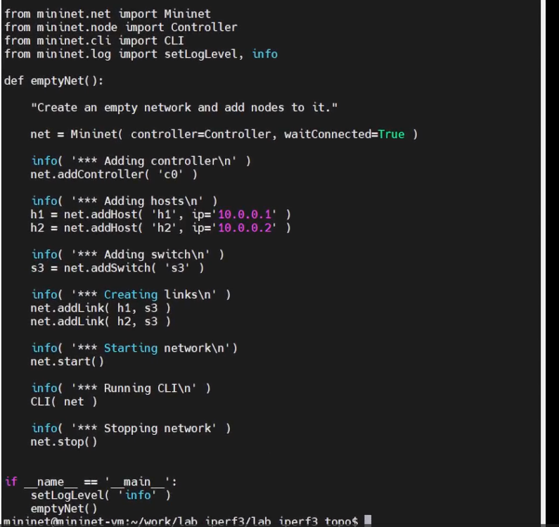
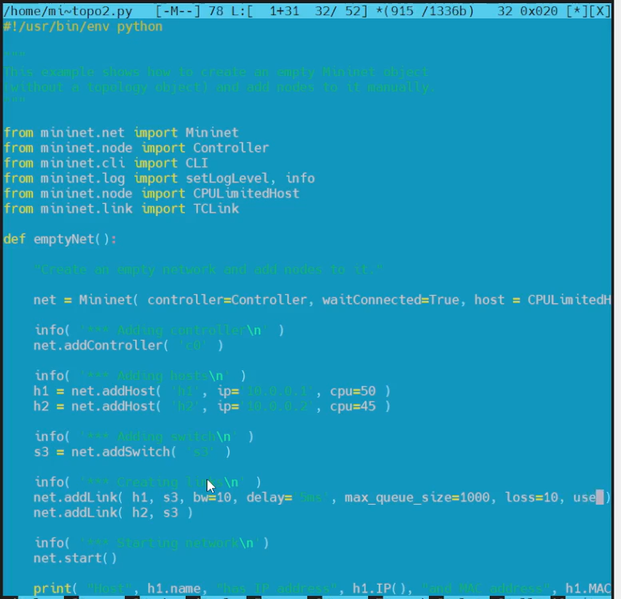
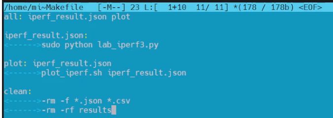
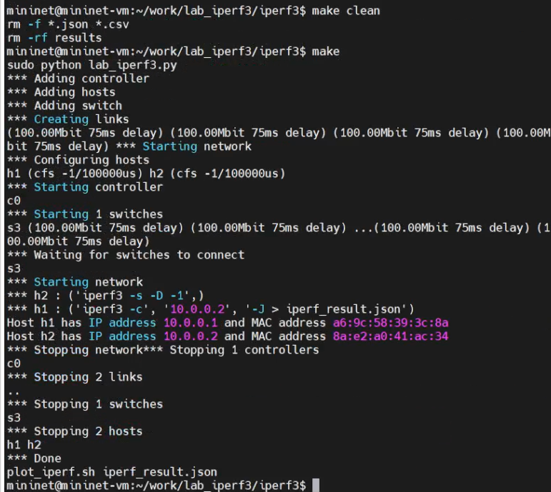
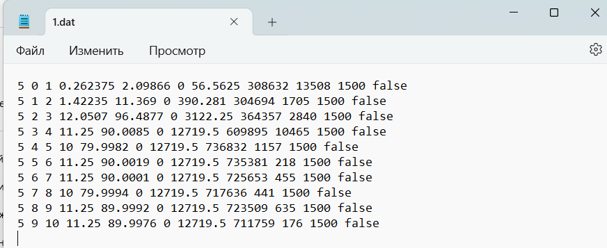
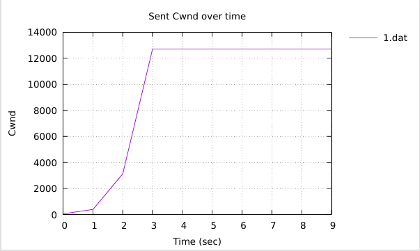
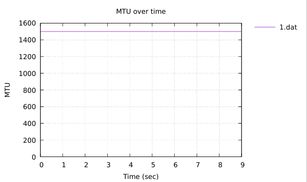
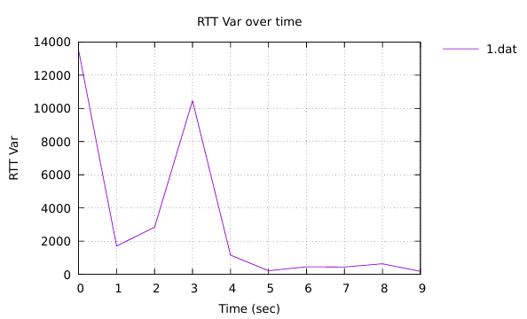
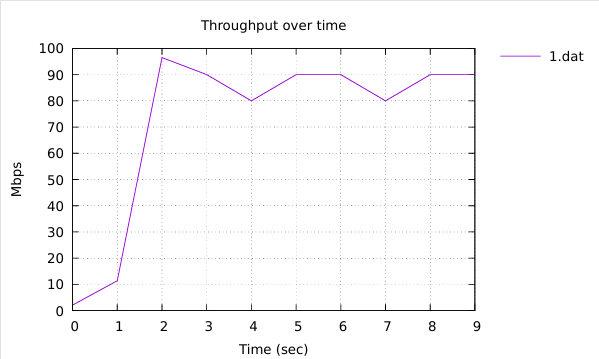

---
## Front matter
title: "Измерение
и тестирование пропускной способности сети. Воспроизводимый эксперимент"
subtitle: "Лабораторная работа № 3"
author: "Шулуужук Айраана НПИбд-02-22"

## Generic otions
lang: ru-RU
toc-title: "Содержание"

## Bibliography
bibliography: bib/cite.bib
csl: pandoc/csl/gost-r-7-0-5-2008-numeric.csl

## Pdf output format
toc: true # Table of contents
toc-depth: 2
lof: true # List of figures
lot: true # List of tables
fontsize: 12pt
linestretch: 1.5
papersize: a4
documentclass: scrreprt
## I18n polyglossia
polyglossia-lang:
  name: russian
  options:
	- spelling=modern
	- babelshorthands=true
polyglossia-otherlangs:
  name: english
## I18n babel
babel-lang: russian
babel-otherlangs: english
## Fonts
mainfont: IBM Plex Serif
romanfont: IBM Plex Serif
sansfont: IBM Plex Sans
monofont: IBM Plex Mono
mathfont: STIX Two Math
mainfontoptions: Ligatures=Common,Ligatures=TeX,Scale=0.94
romanfontoptions: Ligatures=Common,Ligatures=TeX,Scale=0.94
sansfontoptions: Ligatures=Common,Ligatures=TeX,Scale=MatchLowercase,Scale=0.94
monofontoptions: Scale=MatchLowercase,Scale=0.94,FakeStretch=0.9
mathfontoptions:
## Biblatex
biblatex: true
biblio-style: "gost-numeric"
biblatexoptions:
  - parentracker=true
  - backend=biber
  - hyperref=auto
  - language=auto
  - autolang=other*
  - citestyle=gost-numeric
## Pandoc-crossref LaTeX customization
figureTitle: "Рис."
tableTitle: "Таблица"
listingTitle: "Листинг"
lofTitle: "Список иллюстраций"
lotTitle: "Список таблиц"
lolTitle: "Листинги"
## Misc options
indent: true
header-includes:
  - \usepackage{indentfirst}
  - \usepackage{float} # keep figures where there are in the text
  - \floatplacement{figure}{H} # keep figures where there are in the text
---

# Цель работы

Основной целью работы является знакомство с инструментом для измерения
пропускной способности сети в режиме реального времени — iPerf3, а также
получение навыков проведения воспроизводимого эксперимента по измерению
пропускной способности моделируемой сети в среде Mininet.

# Выполнение лабораторной работы

## Создание простейшей топологии сети

В каталоге /work/lab_iperf3 для работы над проектом создадим каталог lab_iperf3_topo и скопируем в него файл с примером скрипта mininet/examples/emptynet.py, описывающего стандартную простую
топологию сети mininet (рис. [-@fig:001]) 

{#fig:001 width=70%}

Изучим содержание скрипта lab_iperf3_topo.py (рис. [-@fig:002])

{#fig:002 width=70%}

Запустим скрипт создания топологии и после отработки скрипта посмотрите элементы топологии (рис. [-@fig:003])

{#fig:003 width=70%}

Внесем в скрипт lab_iperf3_topo.py изменение, позволяющее вывести на экран информацию для двух хостов, а именно имя хоста, IP-адрес, MAC-адрес (рис. [-@fig:004])

{#fig:004 width=70%}

Проверим корректность выполнения вывода (рис. [-@fig:005])

{#fig:005 width=70%}

Mininet предоставляет функции ограничения производительности и изо-
ляции с помощью классов CPULimitedHost и TCLink. 
- Добавим в скрипт настройки параметров производительности. В начале скрипта lab_iperf3_topo2.py добавим записи об импорте классов CPULimitedHost и TCLink. 
- Изменим строку описания сети, указав на использование ограничения производительности и изоляции
- Изменим функцию задания параметров виртуального хоста h1, указав, что ему будет выделено 50% от общих
ресурсов процессора системы, для хоста 2 выделим 45%
- Изменим функцию параметров соединения между хостом h1 и коммутатором s3 (рис. [-@fig:006])

{#fig:006 width=70%}

Запустим на отработку сначала скрипт lab_iperf3_topo2.py, затем lab_iperf3_topo.py и сравните результат (рис. [-@fig:007]) (рис. [-@fig:008])
 
{#fig:007 width=70%}

{#fig:008 width=70%}

## Построение графиков по проводимому эксперименту

Сделайем копию скрипта lab_iperf3_topo2.py и поместите его в подкаталог iperf. В начале скрипта lab_iperf3.py импортируем библиотеку time. Изменим код в скрипте lab_iperf3.py так, чтобы:
– на хостах не было ограничения по использованию ресурсов процессора;
– каналы между хостами и коммутатором были по 100 Мбит/с с задержкой 75 мс, без потерь, без использования ограничителей пропускной способности и максимального размера очереди (рис. [-@fig:009]).

{#fig:009 width=70%}

После функции старта сети опишишем запуск на хосте h2 сервера iPerf3, а на хосте h1 запуск с задержкой в 10 секунд клиента iPerf3 с экспортом результатов в JSON-файл, закомментируем строки, отвечающие за запуск CLI-интерфейса: (рис. [-@fig:010])

{#fig:010 width=70%}

Запустим итоговый скрипт (рис. [-@fig:011])

{#fig:011 width=70%}

Построем графики из получившегося JSON-файла (рис. [-@fig:012])

{#fig:012 width=70%}

Создадим Makefile для проведения всего эксперимента. В Makefile пропишем запуск скрипта эксперимента, построение графиков и очистку каталога от результатов (рис. [-@fig:013])

{#fig:013 width=70%}

Проверим корректность отработки Makefile (рис. [-@fig:014]) (рис. [-@fig:015])

{#fig:014 width=70%}

Полученные графики (рис. [-@fig:015]) (рис. [-@fig:016]) (рис. [-@fig:017]) (рис. [-@fig:018]) (рис. [-@fig:019]) (рис. [-@fig:020]) (рис. [-@fig:021]) (рис. [-@fig:022])

{#fig:015 width=70%}

{#fig:016 width=70%}

{#fig:017 width=70%}

{#fig:018 width=70%}

{#fig:019 width=70%}

{#fig:020 width=70%}

{#fig:021 width=70%}

{#fig:022 width=70%}

# Выводы

В результате выполнения лабораторной работы было проведено знакомство с инструментом для измерения
пропускной способности сети в режиме реального времени — iPerf3, а также
получение навыков проведения воспроизводимого эксперимента по измерению
пропускной способности моделируемой сети в среде Mininet.
