---
## Front matter
title: "Эмуляция и измерение
задержек в глобальных сетях"
subtitle: "Лабораторная работа № 4"
author: "Шулуужук Айраана НПИбд-02-22"

## Generic otions
lang: ru-RU
toc-title: "Содержание"

## Bibliography
bibliography: bib/cite.bib
csl: pandoc/csl/gost-r-7-0-5-2008-numeric.csl

## Pdf output format
toc: true # Table of contents
toc-depth: 2
lof: true # List of figures
lot: true # List of tables
fontsize: 12pt
linestretch: 1.5
papersize: a4
documentclass: scrreprt
## I18n polyglossia
polyglossia-lang:
  name: russian
  options:
	- spelling=modern
	- babelshorthands=true
polyglossia-otherlangs:
  name: english
## I18n babel
babel-lang: russian
babel-otherlangs: english
## Fonts
mainfont: IBM Plex Serif
romanfont: IBM Plex Serif
sansfont: IBM Plex Sans
monofont: IBM Plex Mono
mathfont: STIX Two Math
mainfontoptions: Ligatures=Common,Ligatures=TeX,Scale=0.94
romanfontoptions: Ligatures=Common,Ligatures=TeX,Scale=0.94
sansfontoptions: Ligatures=Common,Ligatures=TeX,Scale=MatchLowercase,Scale=0.94
monofontoptions: Scale=MatchLowercase,Scale=0.94,FakeStretch=0.9
mathfontoptions:
## Biblatex
biblatex: true
biblio-style: "gost-numeric"
biblatexoptions:
  - parentracker=true
  - backend=biber
  - hyperref=auto
  - language=auto
  - autolang=other*
  - citestyle=gost-numeric
## Pandoc-crossref LaTeX customization
figureTitle: "Рис."
tableTitle: "Таблица"
listingTitle: "Листинг"
lofTitle: "Список иллюстраций"
lotTitle: "Список таблиц"
lolTitle: "Листинги"
## Misc options
indent: true
header-includes:
  - \usepackage{indentfirst}
  - \usepackage{float} # keep figures where there are in the text
  - \floatplacement{figure}{H} # keep figures where there are in the text
---

# Цель работы

Основной целью работы является знакомство с NETEM — инструментом для тестирования производительности приложений в виртуальной сети, а также получение навыков проведения интерактивного и воспроизводимого экспериментов по измерению задержки и её дрожания (jitter) в моделируемой сети в среде Mininet.

# Выполнение лабораторной работы

## Запуск лабораторной топологии

Запустите виртуальную среду с mininet. Из основной ОС подключимся к виртуальной машине. В виртуальной машине mininet при необходимости исправим права запуска X-соединения. Скопируйте значение куки (MIT magic cookie)1 своего пользователя mininet в файл для пользователя root (рис. [-@fig:001]) 

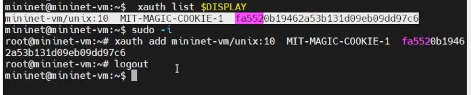{#fig:001 width=70%}

Зададим простейшую топологию, состоящую из двух хостов и коммутатора с назначенной по умолчанию mininet сетью 10.0.0.0/8. После введения этой команды запустятся терминалы двух хостов, коммутатора и контроллера. Терминалы коммутатора и контроллера можно закрыть (рис. [-@fig:002])

{#fig:002 width=70%}

Проверим подключение между хостами h1 и h2 с помощью команды ping с параметром -c 6 (рис. [-@fig:003])

min/avg/max/mdev = 0.052/0.569/2.820/1.010 ms

{#fig:003 width=70%}

## Интерактиивные эксперименты

На хосте h1 добавим задержку в 100 мс к выходному интерфейсу. min/avg/max/mdev = 0.052/0.569/2.820/1.010 ms (рис. [-@fig:004])

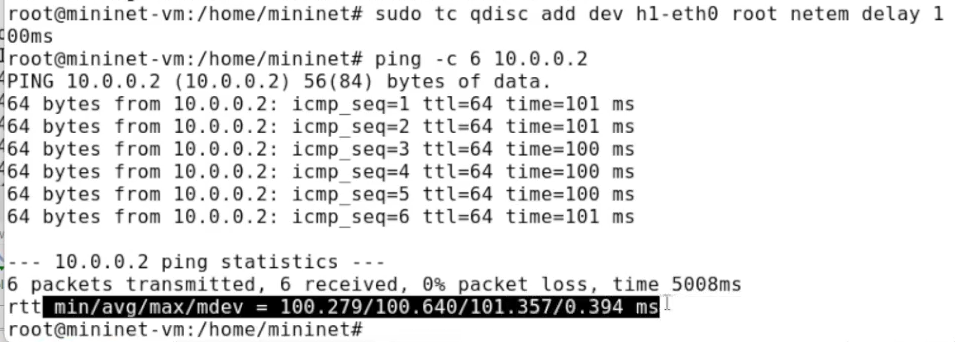{#fig:004 width=70%}

Для эмуляции глобальной сети с двунаправленной задержкой необходимо
к соответствующему интерфейсу на хосте h2 также добавить задержку в 100
миллисекунд. Проверим, что соединение между хостом h1 и хостом h2 имеет RTT в 200 мс
(100 мс от хоста h1 к хосту h2 и 100 мс от хоста h2 к хосту h1), повторив
команду ping с параметром -c 6 на терминале хоста h1 min/avg/max/mdev = 0.052/0.569/2.820/1.010 ms (рис. [-@fig:005])

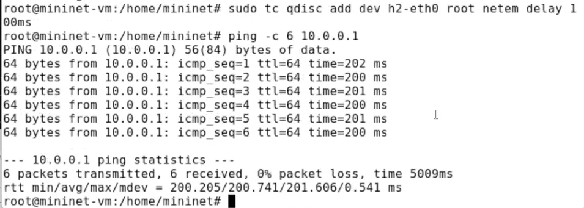{#fig:005 width=70%}

## Изменение задержки в эмулируемой глобальной сети

Измениим задержку со 100 мс до 50 мс для отправителя h1 и для получателя h2. min/avg/max/mdev = 0.052/0.569/2.820/1.010 ms (рис. [-@fig:006]) 

{#fig:006 width=70%}

## Восстановление исходных значений (удаление правил) задержки в эмулируемой глобальной сети

Восстановим конфигурацию по умолчанию, удалив все правила, применённые к сетевому планировщику соответствующего интерфейса для отправителя h1 и для получателя h2. Проверим, что соединение между хостом h1 и хостом h2 не имеет явно установленной задержки, используя команду ping с параметром -c 6 с терминала хоста h1. min/avg/max/mdev = 0.052/0.569/2.820/1.010 ms (рис. [-@fig:007])

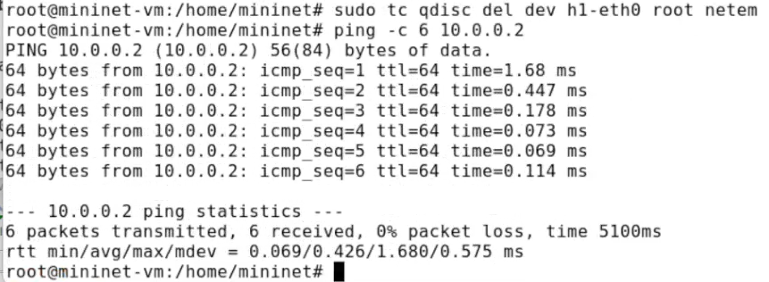{#fig:007 width=70%}

## Добавление значения дрожания задержки в интерфейс подключения к эмулируемой глобальной сети

Добавим на узле h1 задержку в 100 мс со случайным отклонением 10 мс. Проверим, что соединение от хоста h1 к хосту h2 имеет задержку 100 мс со случайным отклонением ±10 мс, используя в терминале хоста h1 команду ping с параметром -c 6. min/avg/max/mdev = 0.052/0.569/2.820/1.010 ms (рис. [-@fig:008])

{#fig:008 width=70%}

## Добавление значения корреляции для джиттера и задержки в интерфейс подключения к эмулируемой глобальной сети

Добавим на интерфейсе хоста h1 задержку в 100 мс с вариацией ±10 мс и значением корреляции в 25%. Убедимся, что все пакеты, покидающие устройство h1 на интерфейсе h1-eth0, будут иметь время задержки 100 мс со случайным отклонением ±10 мс, при этом время передачи следующего пакета зависит от предыдущего значения на 25%. Используем для этого в терминале хоста h1 команду ping
с параметром -c 20. min/avg/max/mdev = 0.052/0.569/2.820/1.010 ms (рис. [-@fig:009]) (рис. [-@fig:010])

{#fig:009 width=70%}

{#fig:010 width=70%}

## Распределение задержки в интерфейсе подключения к эмулируемой глобальной сети

Задаим нормальное распределение задержки на узле h1 в эмулируемой сети. Убедимся, что все пакеты, покидающие хост h1 на интерфейсе h1-eth0, будут иметь время задержки, которое распределено в диапазоне 100 мс ±20 мс. Используем для этого команду ping на терминале хоста h1 с параметром
-c 10. (рис. [-@fig:011])

{#fig:011 width=70%}

## Воспроизведение экспериментов. Предварительная подготовка

Обновим репозитории программного обеспечения на виртуальной машине (рис. [-@fig:012])

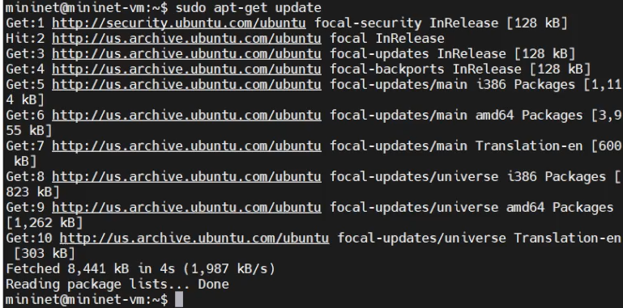{#fig:012 width=70%}

Установим пакет geeqie — понадобится для просмотра файлов png (рис. [-@fig:013])

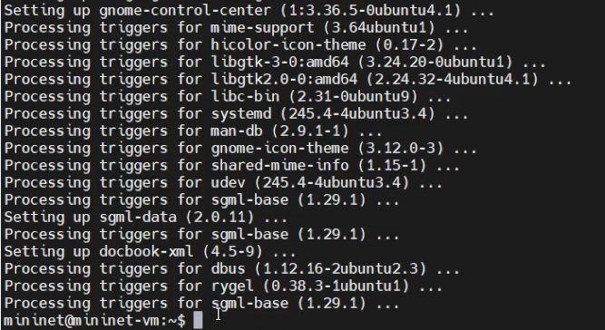{#fig:013 width=70%}

## Добавление задержки для интерфейса, подключающегося к эмулируемой глобальной сети

С помощью API Mininet воспроизведите эксперимент по добавлению задержки для интерфейса хоста, подключающегося к эмулируемой глобальной сети. В виртуальной среде mininet в своём рабочем каталоге с проектами создадим каталог simple-delay и перейдем в него (рис. [-@fig:014]) (рис. [-@fig:015])

{#fig:014 width=70%}

Создадим скрипт для эксперимента lab_netem_i.py (рис. [-@fig:015]) 

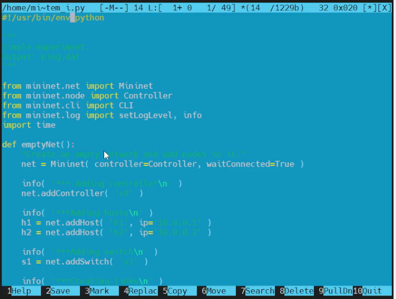{#fig:015 width=70%}

Создим скрипт для визуализации ping_plot результатов эксперимента (рис. [-@fig:016]) 

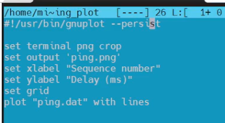{#fig:016 width=70%}

Создадим Makefile для управления процессом проведения эксперимента (рис. [-@fig:017]) 

{#fig:017 width=70%}

Выполним эксперимент (рис. [-@fig:018]) (рис. [-@fig:019]) 

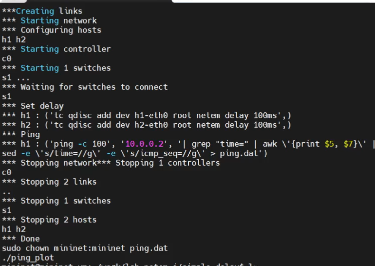{#fig:018 width=70%}

{#fig:019 width=70%}

Из файла ping.dat удалим первую строку и заново построем график (рис. [-@fig:020]) (рис. [-@fig:021]) 

{#fig:020 width=70%}

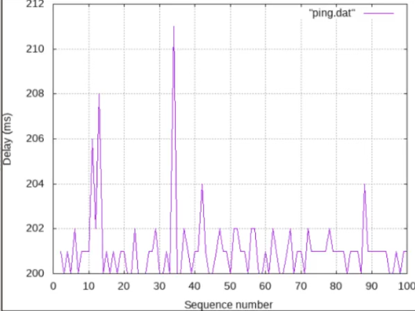{#fig:021 width=70%}

Разработаем скрипт для вычисления на основе данных файла ping.dat минимального, среднего, максимального и стандартного отклонения времени приёма-передачи (рис. [-@fig:022])

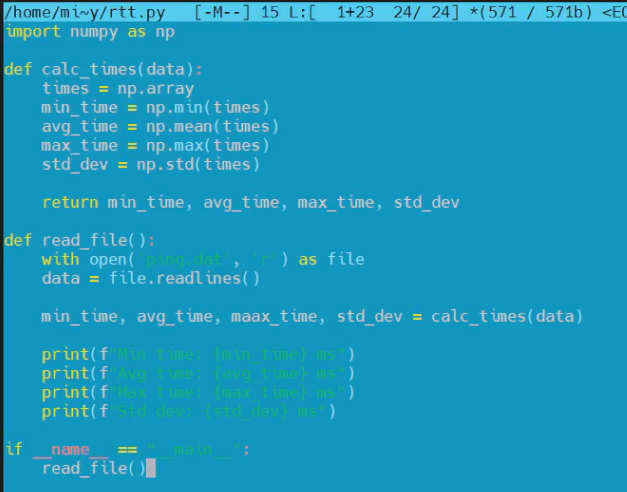{#fig:022 width=70%}

Добавьте правило запуска скрипта в Makefile (рис. [-@fig:023])

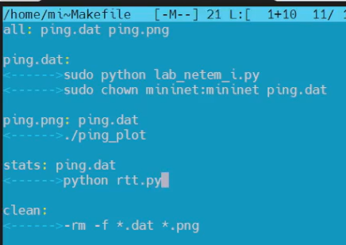{#fig:023 width=70%}

Продемонстрируем работу скрипта с выводом значений на экран или в отдельный файл (рис. [-@fig:024])

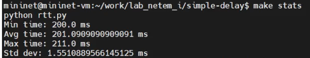{#fig:024 width=70%}

## Задание для самостоятельной работы

Реализуем евоспроизводимые эксперименты по изменению задержки, джиттера, значения корреляции для джиттера и задержки, распределения времени задержки в эмулируемой глобальной сети. Постройте графики.
Вычислите минимальное, среднее, максимальное и стандартное отклонение времени приёма-передачи для каждого случая

Эксперимент по изменению задержки (рис. [-@fig:025]) (рис. [-@fig:026]) (рис. [-@fig:027]) 

{#fig:025 width=70%}

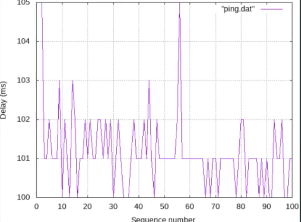{#fig:026 width=70%}

{#fig:027 width=70%}

Добавление значения для джиттера и задержки в интерфейс подключения к эмулируемой глобальной сети (рис. [-@fig:028]) (рис. [-@fig:029]) (рис. [-@fig:030]) 

{#fig:028 width=70%} 

{#fig:029 width=70%}

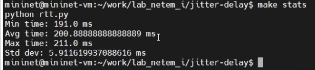{#fig:030 width=70%}

Значения корреляции для джиттера и задержки (рис. [-@fig:031]) (рис. [-@fig:032]) (рис. [-@fig:033]) 

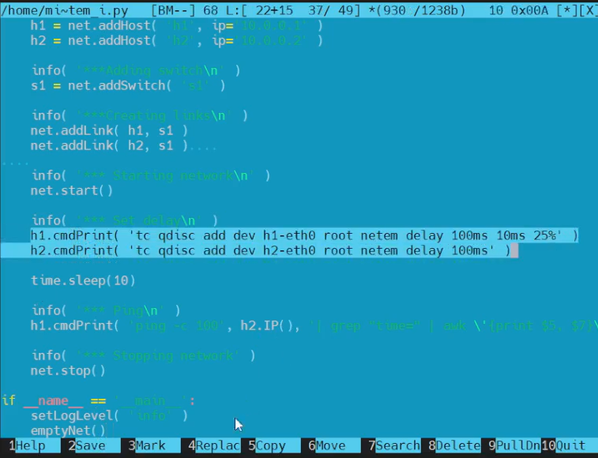{#fig:031 width=70%}

{#fig:032 width=70%}

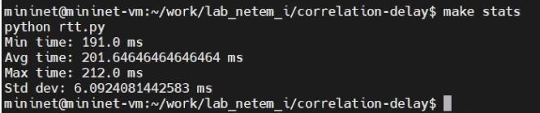{#fig:033 width=70%}

Распределения времени задержки в эмулируемой глобальной сети (рис. [-@fig:034]) (рис. [-@fig:035]) (рис. [-@fig:036]) 

{#fig:034 width=70%}

{#fig:035 width=70%}

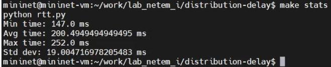{#fig:036 width=70%}

# Выводы

В результате выполнения лабораторной работы было проведено знакомство с NETEM — инструментом для
тестирования производительности приложений в виртуальной сети, а также
получение навыков проведения интерактивного и воспроизводимого экспе-
риментов по измерению задержки и её дрожания (jitter) в моделируемой сети
в среде Mininet.
