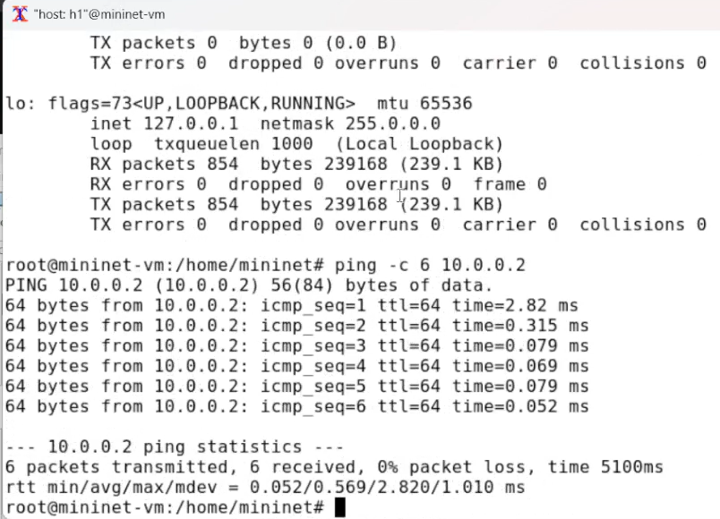
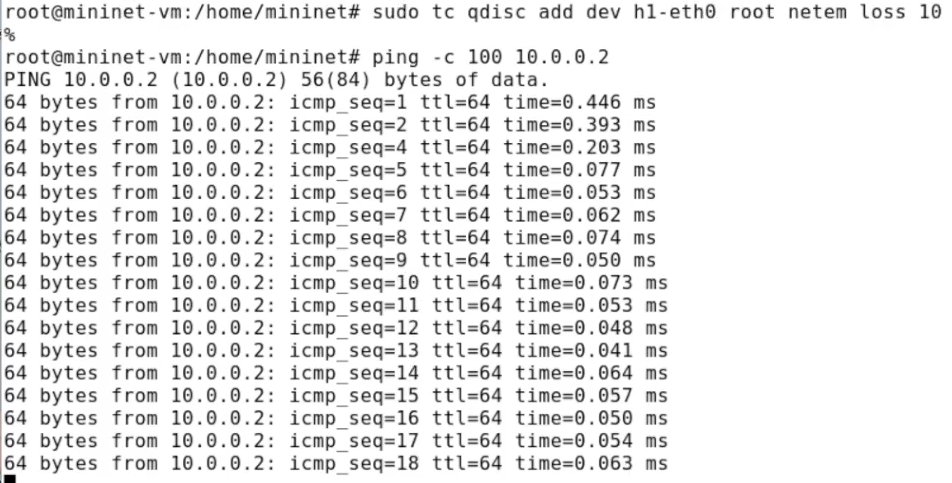
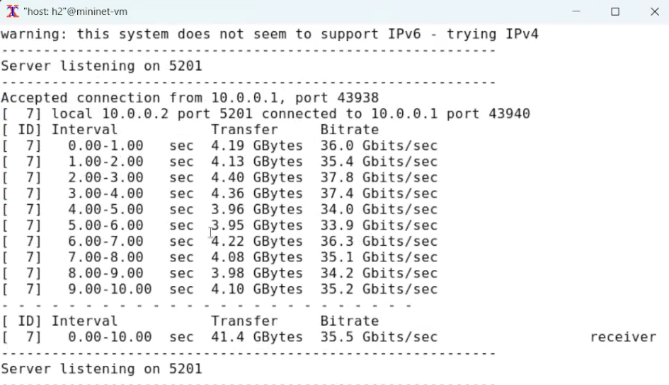
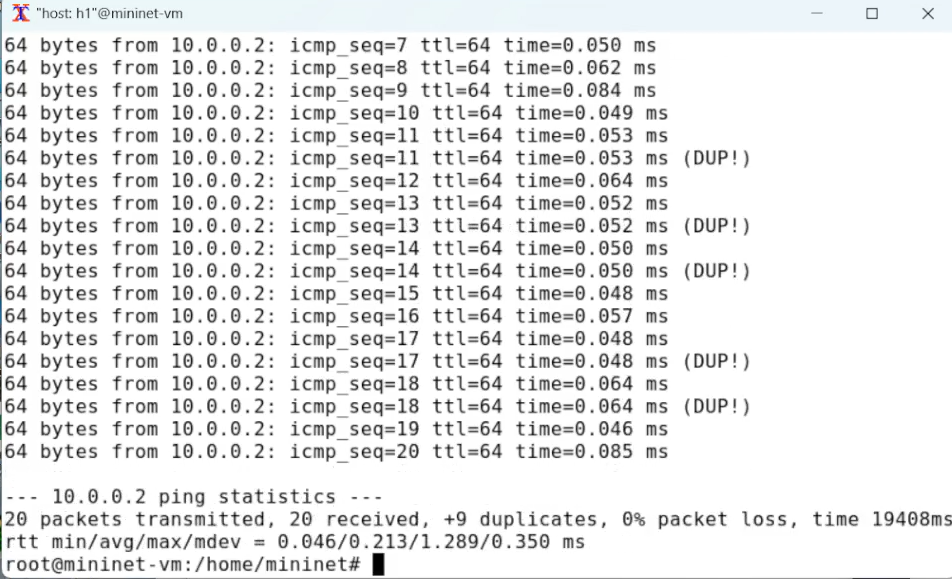
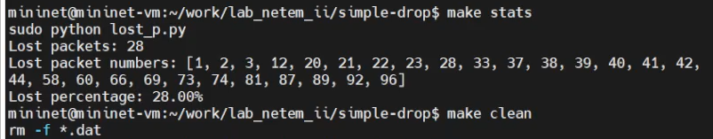
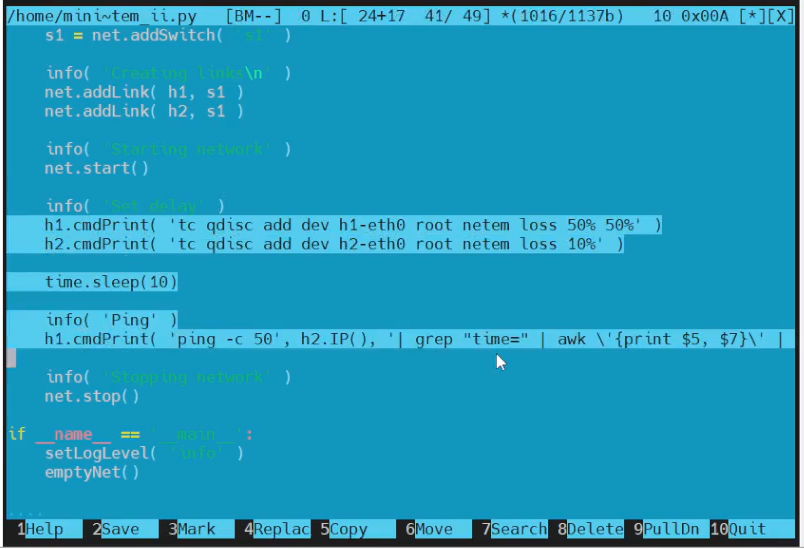
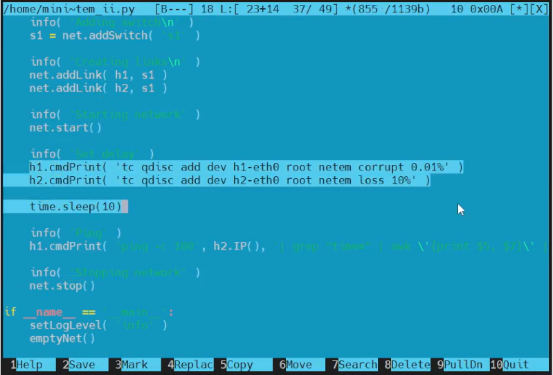
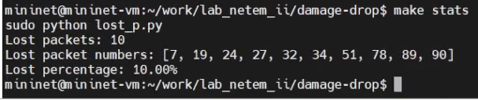
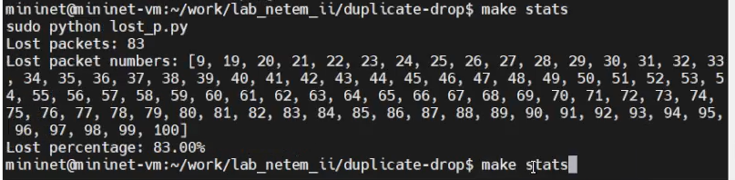

---
## Front matter
lang: ru-RU
title: "Эмуляция и измерение потерь пакетов в глобальных сетях"
subtitle: "Лабораторная работа № 5"
author:
  - Шулуужук А. В.
institute:
  - Российский университет дружбы народов, Москва, Россия
date: 4 ноября 2025

## i18n babel
babel-lang: russian
babel-otherlangs: english

## Formatting pdf
toc: false
toc-title: Содержание
slide_level: 2
aspectratio: 169
section-titles: true
theme: metropolis
header-includes:
 - \metroset{progressbar=frametitle,sectionpage=progressbar,numbering=fraction}
 - '\makeatletter'
 - '\beamer@ignorenonframefalse'
 - '\makeatother'
---

## Цели и задачи

Основной целью работы является получение навыков проведения интерактивных экспериментов в среде Mininet по исследованию параметров сети, связанных с потерей, дублированием, изменением порядка и повреждением пакетов при передаче данных. Эти параметры влияют на производительность протоколов и сетей.

# Выполнение лабораторной работы

## Запуск лабораторной топологии

{#fig:001 width=70%}

## Запуск лабораторной топологии

{#fig:002 width=70%}

## Запуск лабораторной топологии

{#fig:003 width=60%}

## Добавление потери пакетов на интерфейс, подключённый к эмулируемой глобальной сети
 
{#fig:004 width=70%}

## Добавление потери пакетов на интерфейс, подключённый к эмулируемой глобальной сети

{#fig:005 width=70%}

## Добавление значения корреляции для потери пакетов в эмулируемой глобальной сети

{#fig:006 width=70%}

## Добавление повреждения пакетов в эмулируемой глобальной сети

{#fig:007 width=70%}

## Добавление повреждения пакетов в эмулируемой глобальной сети

{#fig:008 width=70%}

## Добавление переупорядочивания пакетов в интерфейс подключения к эмулируемой глобальной сети

{#fig:009 width=70%}

## Добавление переупорядочивания пакетов в интерфейс подключения к эмулируемой глобальной сети

{#fig:010 width=50%}

## Добавление дублирования пакетов в интерфейс подключения к эмулируемой глобальной сети

{#fig:011 width=70%}

## Добавление дублирования пакетов в интерфейс подключения к эмулируемой глобальной сети

{#fig:012 width=70%}

## Воспроизведение экспериментов. Добавление потери пакетов на интерфейс, подключённый к эмулируемой глобальной сети

{#fig:013 width=60%}

## Воспроизведение экспериментов. Добавление потери пакетов на интерфейс, подключённый к эмулируемой глобальной сети

{#fig:014 width=70%}

## Воспроизведение экспериментов. Добавление потери пакетов на интерфейс, подключённый к эмулируемой глобальной сети

{#fig:015 width=70%}

## Воспроизведение экспериментов. Добавление потери пакетов на интерфейс, подключённый к эмулируемой глобальной сети

{#fig:016 width=70%}

## Задание для самостоятельной работы

- Добавление значения корреляции для потери пакетов в эмулируемой глобальной сети

{#fig:017 width=50%}

## Задание для самостоятельной работы

{#fig:018 width=70%}

## Задание для самостоятельной работы

- Добавление повреждения пакетов в эмулируемой глобальной сети

{#fig:019 width=50%}

## Задание для самостоятельной работы

{#fig:020 width=70%}

## Задание для самостоятельной работы

- Добавление переупорядочивания пакетов в интерфейс подключения к эмулируемой глобальной сети

{#fig:021 width=50%}

## Задание для самостоятельной работы

{#fig:022 width=70%}

## Задание для самостоятельной работы

- Добавление дублирования пакетов в интерфейс подключения к эмулируемой глобальной сети

{#fig:023 width=50%}

## Задание для самостоятельной работы

{#fig:024 width=70%}

# Выводы

В результате выполнения лабораторной работы были получены навыкы проведения интер-
активных экспериментов в среде Mininet по исследованию параметров сети,
связанных с потерей, дублированием, изменением порядка и повреждением
пакетов при передаче данных. Эти параметры влияют на производительность
протоколов и сетей.
