---
## Front matter
title: "Эмуляция и измерение потерь пакетов в глобальных сетях"
subtitle: "Лабораторная работа № 5"
author: "Шулуужук Айраана НПИбд-02-22"

## Generic otions
lang: ru-RU
toc-title: "Содержание"

## Bibliography
bibliography: bib/cite.bib
csl: pandoc/csl/gost-r-7-0-5-2008-numeric.csl

## Pdf output format
toc: true # Table of contents
toc-depth: 2
lof: true # List of figures
lot: true # List of tables
fontsize: 12pt
linestretch: 1.5
papersize: a4
documentclass: scrreprt
## I18n polyglossia
polyglossia-lang:
  name: russian
  options:
	- spelling=modern
	- babelshorthands=true
polyglossia-otherlangs:
  name: english
## I18n babel
babel-lang: russian
babel-otherlangs: english
## Fonts
mainfont: IBM Plex Serif
romanfont: IBM Plex Serif
sansfont: IBM Plex Sans
monofont: IBM Plex Mono
mathfont: STIX Two Math
mainfontoptions: Ligatures=Common,Ligatures=TeX,Scale=0.94
romanfontoptions: Ligatures=Common,Ligatures=TeX,Scale=0.94
sansfontoptions: Ligatures=Common,Ligatures=TeX,Scale=MatchLowercase,Scale=0.94
monofontoptions: Scale=MatchLowercase,Scale=0.94,FakeStretch=0.9
mathfontoptions:
## Biblatex
biblatex: true
biblio-style: "gost-numeric"
biblatexoptions:
  - parentracker=true
  - backend=biber
  - hyperref=auto
  - language=auto
  - autolang=other*
  - citestyle=gost-numeric
## Pandoc-crossref LaTeX customization
figureTitle: "Рис."
tableTitle: "Таблица"
listingTitle: "Листинг"
lofTitle: "Список иллюстраций"
lotTitle: "Список таблиц"
lolTitle: "Листинги"
## Misc options
indent: true
header-includes:
  - \usepackage{indentfirst}
  - \usepackage{float} # keep figures where there are in the text
  - \floatplacement{figure}{H} # keep figures where there are in the text
---

# Цель работы

Основной целью работы является получение навыков проведения интерактивных экспериментов в среде Mininet по исследованию параметров сети, связанных с потерей, дублированием, изменением порядка и повреждением пакетов при передаче данных. Эти параметры влияют на производительность протоколов и сетей.

# Выполнение лабораторной работы

## Запуск лабораторной топологии

Запустим виртуальную среду с mininet. Из основной ОС подключимся к виртуальной машине. В виртуальной машине mininet при необходимости исправим права запуска X-соединения. Скопируйте значение куки (MIT magic cookie)1 своего пользователя mininet в файл для пользователя root (рис. [-@fig:001]) 

{#fig:001 width=70%}

Зададим простейшую топологию, состоящую из двух хостов и коммутатора с назначенной по умолчанию mininet сетью 10.0.0.0/8. После введения этой команды запустятся терминалы двух хостов, коммутатора и контроллера. Терминалы коммутатора и контроллера можно закрыть (рис. [-@fig:002])

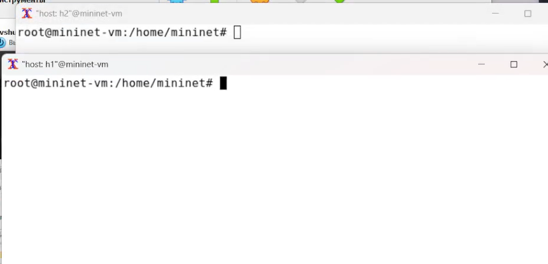{#fig:002 width=70%}

Проверим подключение между хостами h1 и h2 с помощью команды ping с параметром -c 6 (рис. [-@fig:003])

min/avg/max/mdev = 0.052/0.569/2.820/1.010 ms

{#fig:003 width=70%}

## Добавление потери пакетов на интерфейс, подключённый к эмулируемой глобальной сети

Пакеты могут быть потеряны в процессе передачи из-за таких факторов, как битовые ошибки и перегрузка сети. Скорость потери данных часто измеряется как процентная доля потерянных пакетов по отношению к количеству отправленных пакетов

На хосте h1 добавим 10% потерь пакетов к интерфейсу h1-eth0. Проверим, что на соединении от хоста h1 к хосту h2 имеются потери пакетов, используя команду ping с параметром -c 100 с хоста h1. Параметр -c указывает общее количество пакетов для отправки. Обратите внимание на значения icmp_seq. Некоторые номера последовательности отсутствуют из-за потери пакетов. Процент потерянных пакетов составило 5% (рис. [-@fig:004]) 

{#fig:004 width=70%}

Для эмуляции глобальной сети с потерей пакетов в обоих направлениях необходимо к соответствующему интерфейсу на хосте h2 также добавить 10% потерь пакетов. Проверьте, что соединение между хостом h1 и хостом h2 имеет больший процент потерянных данных (10% от хоста h1 к хосту h2 и 10% от хоста h2 к хосту h1), повторив команду ping с параметром -c 100 на терминале хоста h1. Процент потерянных пакетов составило 12% (рис. [-@fig:005])

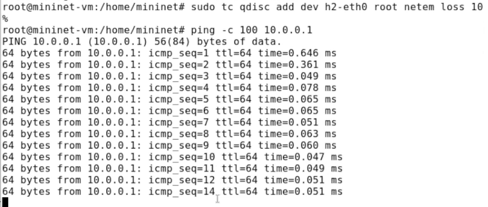{#fig:005 width=70%}

## Добавление значения корреляции для потери пакетов в эмулируемой глобальной сети

Добавим на интерфейсе узла h1 коэффициент потери пакетов 50% (такой высокий уровень потери пакетов маловероятен), и каждая последующая вероятность зависит на 50% от последней. Проверим, что на соединении от хоста h1 к хосту h2 имеются потери пакетов, используя команду ping с параметром -c 50 с хоста h1. Процент потерянных пакетов составило 66 %. Номера пакетов: 1 2 4 6 7 8 9 10 12 13 17 18 19 20 21 22 23 24 25 26 27 31 32 33 34 35 38 39 40 41 46 47 48  (рис. [-@fig:006]) 

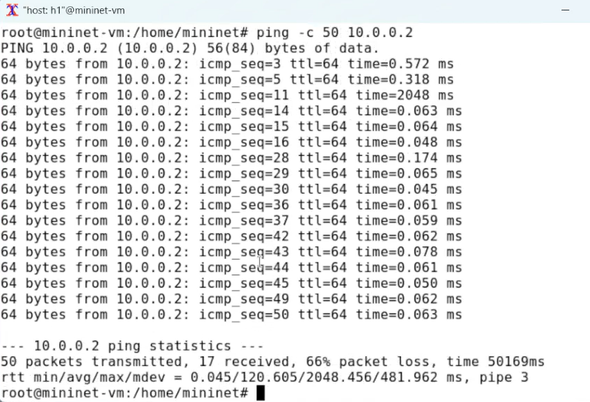{#fig:006 width=70%}

## Добавление повреждения пакетов в эмулируемой глобальной сети

Добавим на интерфейсе узла h1 0,01% повреждения пакетов (рис. [-@fig:007]) (рис. [-@fig:008]) 

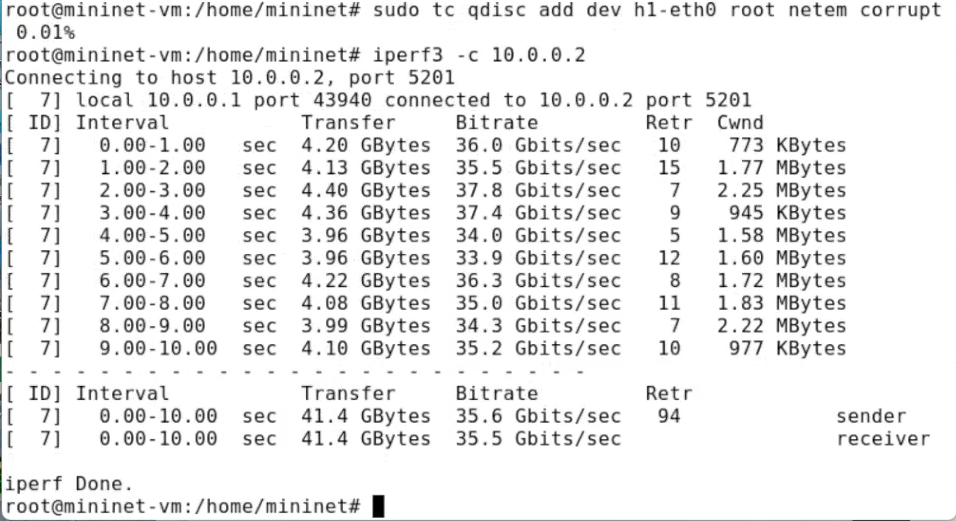{#fig:007 width=70%}

{#fig:008 width=70%}

## Добавление переупорядочивания пакетов в интерфейс подключения к эмулируемой глобальной сети

Добавим на интерфейсе узла h1 правило: 25% пакетов (со значением корреляции 50%) будут отправлены немед-
ленно, а остальные 75% будут задержаны на 10 мс (рис. [-@fig:009]) (рис. [-@fig:010])

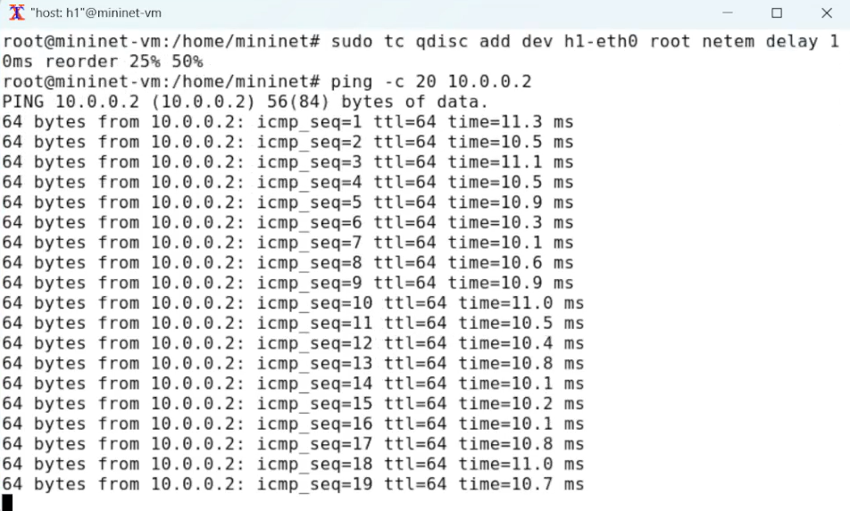{#fig:009 width=70%}

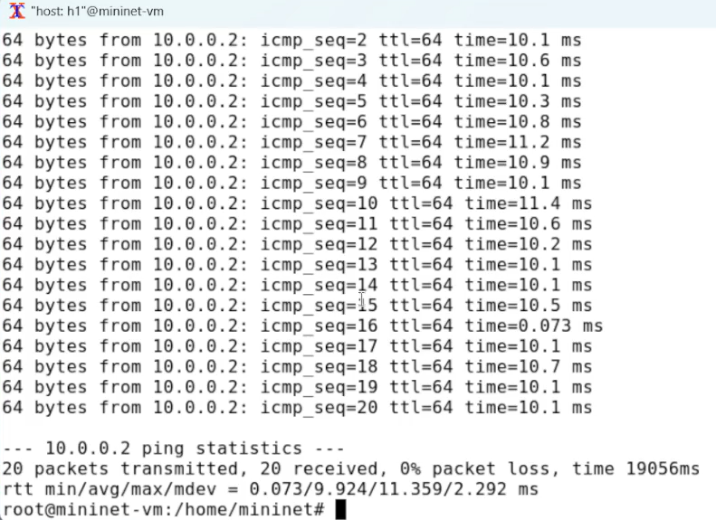{#fig:010 width=70%}

## Добавление дублирования пакетов в интерфейс подключения к эмулируемой глобальной сети

Для интерфейса узла h1 зададим правило c дублированием 50% пакетов (т.е. 50% пакетов должны быть получены дважды)  (рис. [-@fig:011])

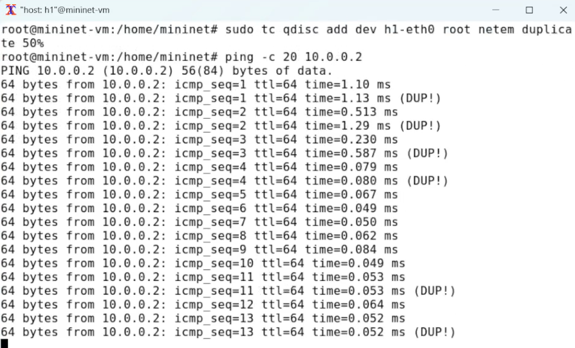{#fig:011 width=70%}

Проверим, что на соединении от хоста h1 к хосту h2 имеются дублированные пакеты, используя команду ping с параметром -c 20 с хоста h1. Дубликаты пакетов помечаются как DUP!  (рис. [-@fig:012])

{#fig:012 width=70%}

## Воспроизведение экспериментов. Добавление потери пакетов на интерфейс, подключённый к эмулируемой глобальной сети

Создадим скрипт для эксперимента lab_netem_ii.py (рис. [-@fig:013])

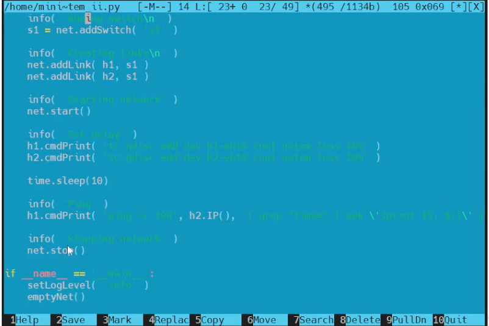{#fig:013 width=70%}

Создадим скрипт, который на экран или в отдельный файл выводит информацию о потерях пакетов (рис. [-@fig:014])

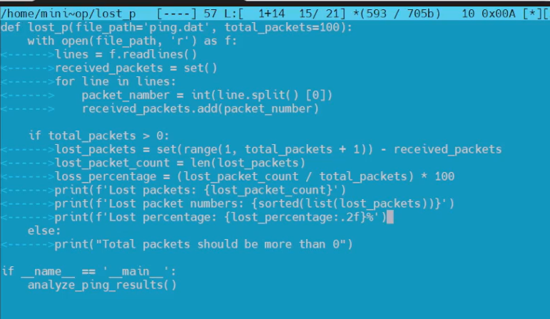{#fig:014 width=70%}

Создадим Makefile для управления процессом проведения эксперимента (рис. [-@fig:015])

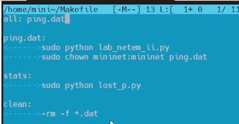{#fig:015 width=70%}

Выполним эксперимент (рис. [-@fig:016]) 

{#fig:016 width=70%}

## Задание для самостоятельной работы

Самостоятельно реализуйте воспроизводимые эксперименты по исследованию параметров сети, связанных с потерей, изменением порядка и повреждением пакетов при передаче данных.

- Добавление значения корреляции для потери пакетов в эмулируемой глобальной сети (рис. [-@fig:017]) 

{#fig:017 width=70%}

Выполним эксперимент (рис. [-@fig:018]) 

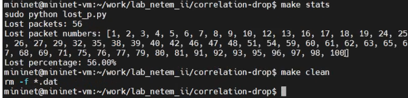{#fig:018 width=70%}

- Добавление повреждения пакетов в эмулируемой глобальной сети (рис. [-@fig:019]) 

{#fig:019 width=70%}

Выполним эксперимент (рис. [-@fig:020]) 

{#fig:020 width=70%}

- Добавление переупорядочивания пакетов в интерфейс подключения к эмулируемой глобальной сети (рис. [-@fig:021]) 

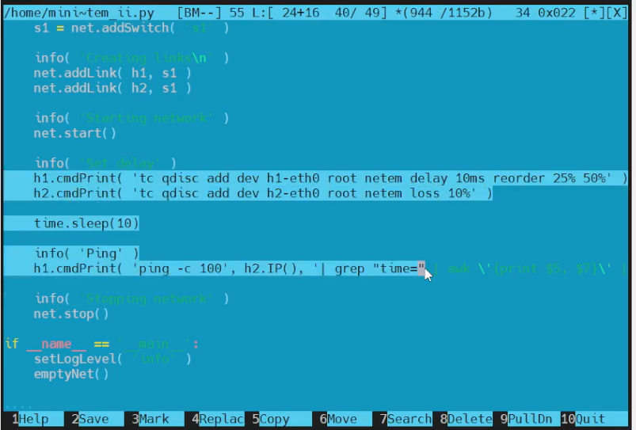{#fig:021 width=70%}

Выполним эксперимент (рис. [-@fig:022]) 

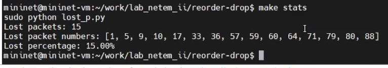{#fig:022 width=70%}

- Добавление дублирования пакетов в интерфейс подключения к эмулируемой глобальной сети (рис. [-@fig:023]) 

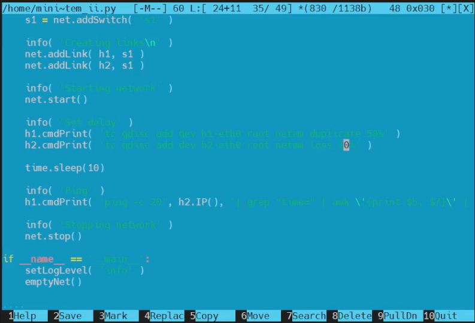{#fig:023 width=70%}

Выполним эксперимент (рис. [-@fig:024]) 

{#fig:024 width=70%}

# Выводы

В результате выполнения лабораторной работы были получены навыкы проведения интер-
активных экспериментов в среде Mininet по исследованию параметров сети,
связанных с потерей, дублированием, изменением порядка и повреждением
пакетов при передаче данных. Эти параметры влияют на производительность
протоколов и сетей.
